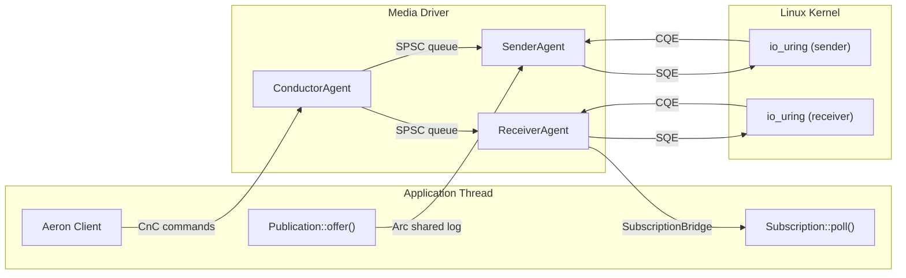

# AERON-RS

A zero-copy, io_uring-native Aeron media driver in Rust, inspired by [Aeron](https://github.com/real-logic/aeron) by Real Logic.

## Overview

`aeron-rs` is a high-performance UDP transport layer implementing the Aeron wire protocol. It's designed for situations where you need ultra-low latency, zero-allocation messaging over UDP - such as high-frequency trading, real-time telemetry, or latency-critical distributed systems.

The entire I/O path runs through `io_uring` with multishot receive and provided buffer rings, eliminating per-message syscalls in steady state.

## Features

- **io_uring Native**: Multishot `RecvMsgMulti` + provided buffer ring - zero syscalls per received message
- **Zero-Copy Receive**: Kernel picks buffers from a shared ring; no userspace-to-kernel copy
- **Allocation-Free Hot Path**: All buffers pre-allocated at init; zero heap allocation in steady state
- **Single-Threaded Agents**: One thread per agent, one io_uring ring per agent - no locks, no contention
- **Aeron Wire Protocol**: Full frame parsing (Data, SM, NAK, Setup, RTTM, Heartbeat) in < 0.5 ns
- **Sub-10ns Offer Path**: ~8.6 ns offer (empty), ~10.2 ns offer (64B) into term buffer
- **Sub-10ns Poll Path**: ~9.4 ns per fragment, ~7.6 ns/fragment batched (16 frames)
- **Cache-Oriented**: 64-byte aligned slots, stack-local CQE batching, flat-array dispatch
- **CnC IPC**: mmap'd Command-and-Control region (anonymous or file-backed) with MPSC ring buffer + broadcast
- **3-Agent Thread Model**: Conductor, Sender, Receiver agents on dedicated threads with lock-free SPSC command queues
- **Client Library**: `MediaDriver::launch` + `Aeron` client with `add_publication` / `add_subscription` API
- **Cross-Thread Publication**: `ConcurrentPublication` via `Arc<SharedLogBuffer>` + Release/Acquire atomic frame-length commit
- **Subscription Data Path**: `SharedImage` + `SubscriptionBridge` (lock-free SPSC) + `Subscription::poll` for cross-thread data delivery
- **Flow Control**: Sender-limit from Status Messages (consumption_position + receiver_window)
- **Loss Recovery**: NAK-driven retransmit with delay/linger state machine (pre-sized flat array, zero-alloc)
- **Subscriber Gap-Skip**: Unrecoverable gaps detected via receiver_position, scanned forward to next committed frame (ADR-002)
- **RTT Measurement**: RTTM echo with EWMA smoothed RTT (shift-based, no division)

## Requirements

- **Linux** with io_uring support (kernel >= 5.19 for provided buffer rings)
- **x86_64** little-endian target (compile-time enforced)
- Rust 2024 edition

## Installation

Add to your `Cargo.toml`:

```toml
[dependencies]
aeron-rs = { path = "." }
```

## Quick Start

### In-Process Driver + Client (Recommended)

```rust
use aeron_rs::client::media_driver::MediaDriver;
use aeron_rs::context::DriverContext;

// Launch the media driver (conductor + sender + receiver threads).
let driver = MediaDriver::launch(DriverContext::default())
    .expect("driver launch");

// Connect a client.
let mut aeron = driver.connect().expect("connect");

// Add a publication - creates transport, endpoint, and cross-thread publication.
let mut pub_h = aeron
    .add_publication("aeron:udp?endpoint=127.0.0.1:40123", 10)
    .expect("add publication");

// Offer data (zero-copy into shared log buffer, sender agent scans + sends).
pub_h.offer(&[1, 2, 3, 4]).expect("offer");

// Keep the driver alive with heartbeats.
aeron.heartbeat();

// Shutdown.
drop(aeron);
driver.close().expect("close");
```

### Low-Level Agent API

For fine-grained control, use the agents directly:

<details>
<summary>Sender Agent</summary>

```rust
use std::net::SocketAddr;
use aeron_rs::agent::Agent;
use aeron_rs::agent::sender::SenderAgent;
use aeron_rs::context::DriverContext;
use aeron_rs::media::channel::UdpChannel;
use aeron_rs::media::send_channel_endpoint::SendChannelEndpoint;
use aeron_rs::media::transport::UdpChannelTransport;

let ctx = DriverContext::default();

// Parse an Aeron channel URI and open a UDP transport.
let channel = UdpChannel::parse("aeron:udp?endpoint=127.0.0.1:40123")
    .expect("channel parse");
let local: SocketAddr = "0.0.0.0:0".parse().unwrap();
let transport = UdpChannelTransport::open(
    &channel, &local, &channel.remote_data, &ctx,
).expect("transport open");

// Create agent, register endpoint, add a publication.
let endpoint = SendChannelEndpoint::new(channel, transport);
let mut agent = SenderAgent::new(&ctx).expect("sender agent");
let ep_idx = agent.add_endpoint(endpoint).expect("add endpoint");

agent.add_publication(
    ep_idx,
    /*session_id=*/ 1001,
    /*stream_id=*/ 10,
    /*initial_term_id=*/ 0,
    /*term_length=*/ 1 << 16,
    /*mtu=*/ 1408,
);

// Run the duty cycle - heartbeats and setups are sent automatically.
loop {
    let _work = agent.do_work().expect("duty cycle");
}
```

</details>

<details>
<summary>Receiver Agent</summary>

```rust
use std::net::SocketAddr;
use aeron_rs::agent::Agent;
use aeron_rs::agent::receiver::ReceiverAgent;
use aeron_rs::context::DriverContext;
use aeron_rs::media::channel::UdpChannel;
use aeron_rs::media::receive_channel_endpoint::ReceiveChannelEndpoint;
use aeron_rs::media::transport::UdpChannelTransport;

let ctx = DriverContext::default();

let channel = UdpChannel::parse("aeron:udp?endpoint=127.0.0.1:40123")
    .expect("channel parse");
let local: SocketAddr = "0.0.0.0:0".parse().unwrap();
let transport = UdpChannelTransport::open(
    &channel, &local, &channel.remote_data, &ctx,
).expect("transport open");

let endpoint = ReceiveChannelEndpoint::new(channel, transport, 0);
let mut agent = ReceiverAgent::new(&ctx).expect("receiver agent");
agent.add_endpoint(endpoint).expect("add endpoint");

// Run the duty cycle - data frames are dispatched, SM/NAK sent back.
loop {
    let _work = agent.do_work().expect("duty cycle");
}
```

</details>

### Direct Poller (Low-Level)

```rust
use std::net::SocketAddr;
use aeron_rs::context::DriverContext;
use aeron_rs::media::channel::UdpChannel;
use aeron_rs::media::poller::{RecvMessage, TransportPoller};
use aeron_rs::media::transport::UdpChannelTransport;
use aeron_rs::media::uring_poller::UringTransportPoller;

let ctx = DriverContext::default();
let mut poller = UringTransportPoller::new(&ctx).expect("poller");

let ch = UdpChannel::parse("aeron:udp?endpoint=127.0.0.1:0").unwrap();
let local: SocketAddr = "127.0.0.1:0".parse().unwrap();
let mut transport = UdpChannelTransport::open(
    &ch, &local, &ch.remote_data, &ctx,
).unwrap();
let tidx = poller.add_transport(&mut transport).unwrap();

// Submit a send.
let frame = [0xABu8; 64];
poller.submit_send(tidx, &frame, None).unwrap();
poller.flush().unwrap();

// Poll completions.
let result = poller.poll_recv(|msg: RecvMessage<'_>| {
    println!("received {} bytes from transport {}", msg.data.len(), msg.transport_idx);
});
```

## How It Works

The driver implements the Aeron media layer with three dedicated agent threads and io_uring replacing all traditional socket syscalls:

1. **Conductor Agent**: Reads client commands from CnC (add/remove publication/subscription, keepalive), dispatches to sender/receiver via internal SPSC queues, writes responses via broadcast buffer
2. **Sender Agent**: Scans publications for committed frames, sends data/heartbeat/setup/RTTM via io_uring, receives SM/NAK control messages, drives retransmit handler
3. **Receiver Agent**: Receives data frames via multishot io_uring, dispatches to images (O(1) hash lookup), detects gaps and schedules NAKs, sends SM/NAK/RTTM replies, deposits images to subscriptions via lock-free bridge
4. **Client Library**: `Aeron` client uses CnC ring buffer for commands and `PublicationBridge` (lock-free SPSC) to transfer publications to the sender; cross-thread `offer()` via `Arc<SharedLogBuffer>` + atomic frame-length commit; `Subscription::poll()` reads from `SharedImage` buffers discovered via `SubscriptionBridge`



## Configuration

```rust
use aeron_rs::context::DriverContext;

let ctx = DriverContext {
    // Socket buffers
    socket_rcvbuf: 2 * 1024 * 1024,        // SO_RCVBUF (default 2 MiB)
    socket_sndbuf: 2 * 1024 * 1024,        // SO_SNDBUF (default 2 MiB)
    mtu_length: 1408,                       // Max frame payload
    multicast_ttl: 0,                       // Multicast TTL (0 = system default)

    // io_uring
    uring_ring_size: 512,                   // SQ/CQ ring entries (power-of-two)
    uring_recv_slots_per_transport: 16,     // Recv slots per transport
    uring_send_slots: 128,                  // Total send slots
    uring_buf_ring_entries: 256,            // Provided buffer ring (power-of-two, max 32768)
    uring_sqpoll: false,                    // Kernel-side SQ polling
    uring_sqpoll_idle_ms: 1000,             // SQPOLL idle timeout

    // Sender timing
    heartbeat_interval_ns: 100_000_000,     // 100 ms
    send_duty_cycle_ratio: 4,               // Send:poll ratio
    term_buffer_length: 64 * 1024,          // 64 KiB per partition (x4 = 256 KiB per pub)
    retransmit_unicast_delay_ns: 0,         // Retransmit delay (0 = immediate)
    retransmit_unicast_linger_ns: 60_000_000, // Retransmit linger (60 ms)

    // Receiver timing
    sm_interval_ns: 200_000_000,            // Status message interval (200 ms)
    nak_delay_ns: 60_000_000,               // NAK delay (60 ms)
    rttm_interval_ns: 1_000_000_000,        // RTTM interval (1 s)
    max_receiver_images: 256,               // Max concurrent images [1, 256]
    receiver_window: None,                  // SM window override (None = term_length / 2)
    send_sm_on_data: false,                 // Immediate SM after data (Aeron C SEND_SM_ON_DATA)

    // General
    driver_timeout_ns: 10_000_000_000,      // Client liveness timeout (10 s)
    timer_interval_ns: 1_000_000,           // General timer tick (1 ms)

    // Idle strategy (Backoff: spin -> yield -> park)
    idle_strategy_max_spins: 10,            // Spin iterations before yield
    idle_strategy_max_yields: 5,            // Yield iterations before park
    idle_strategy_min_park_ns: 1_000,       // Min park duration (1 us)
    idle_strategy_max_park_ns: 1_000_000,   // Max park duration (1 ms)
};
```

### Tuning Profiles

Two ready-to-use profiles with copy-paste `DriverContext` snippets:

| Profile | Key Knobs | Result |
|---------|-----------|--------|
| **Low-Latency** | `send_duty_cycle_ratio: 1`, `send_sm_on_data: true`, aggressive idle (100 spins, 10 us max park) | p50 ~5.8 us RTT |
| **High-Throughput** | `uring_send_slots: 1024`, `term_buffer_length: 256 KiB`, `receiver_window: 256 KiB`, 4 MiB socket buffers | ~700K msg/s |

See [docs/configuration_tuning.md](docs/configuration_tuning.md) for parameter-by-parameter rationale, sizing formulas, trade-off analysis, SQPOLL sub-profile, and Linux kernel tuning guidance.

## Wire Protocol

Aeron wire format - little-endian, fixed-size headers, zero-copy parsed via `repr(C, packed)` overlay:

| Frame Type       | Size     | Purpose                           |
|------------------|----------|-----------------------------------|
| Data / Pad       | 32 bytes | Application data + term position  |
| Status Message   | 36 bytes | Flow control (consumption + window) |
| NAK              | 28 bytes | Loss notification (offset + length) |
| Setup            | 40 bytes | Session establishment              |
| RTTM             | 40 bytes | Round-trip time measurement        |
| Heartbeat        | 32 bytes | Keepalive (Data header, no payload) |

```rust
use aeron_rs::frame::*;

// Parse a frame from a byte buffer (< 0.5 ns)
if let Some(hdr) = FrameHeader::parse(&buf) {
    match FrameType::from(hdr.frame_type) {
        FrameType::Data => {
            let data = DataHeader::parse(&buf).unwrap();
            let payload = data.payload(&buf);
            // process payload...
        }
        FrameType::StatusMessage => {
            let sm = StatusMessage::parse(&buf).unwrap();
            // process SM...
        }
        _ => {}
    }
}
```

## Performance

Benchmarks on x86_64 Linux (Criterion). See [docs/performance_design.md](docs/performance_design.md) for full results.

### Userspace Operations

| Operation                       | Latency    |
|---------------------------------|------------|
| FrameHeader::parse              | ~0.3 ns    |
| DataHeader::parse               | ~0.4 ns    |
| classify_frame                  | ~0.5 ns    |
| NAK build + write               | ~1.5 ns    |
| Frame build (DataHeader)        | ~1.5 ns    |
| SlotPool alloc + free           | ~3.0 ns    |
| CQE dispatch (single msg)       | ~19 ns     |
| CQE dispatch (16 msg burst)     | ~26 ns     |
| CQE batch iterate (256 CQEs)    | ~199 ns    |

### Publication & Scan Path

| Operation                                  | Latency    |
|--------------------------------------------|------------|
| offer (empty payload)                      | ~8.6 ns    |
| offer (64B payload)                        | ~10.2 ns   |
| offer (1KiB payload)                       | ~31.5 ns   |
| sender_scan (1 frame)                      | ~9.6 ns    |
| sender_scan (batch 16 frames)              | ~148 ns    |

### Subscriber Poll Path

| Operation                                  | Latency    |
|--------------------------------------------|------------|
| poll_fragments (empty - no data)           | ~1.4 ns    |
| poll_fragments (single frame)              | ~9.4 ns    |
| poll_fragments (batch 16 frames)           | ~122 ns (7.6 ns/fr) |
| poll_fragments (batch 64 frames)           | ~549 ns (8.6 ns/fr) |
| poll_fragments (gap skip, 1 gap in 16)     | ~73.6 ns   |
| poll_fragments (pad frame skip)            | ~51.9 ns   |

### io_uring Kernel Roundtrip

| Operation                       | Latency    |
|---------------------------------|------------|
| Multishot recv reap + recycle   | ~12 ns     |
| submit() empty ring             | ~66 ns    |
| NOP submit + reap (single)      | ~159 ns    |
| NOP submit + reap (burst 16)    | ~337 ns    |
| UDP sendmsg + reap              | ~994 ns    |
| UDP sendmsg + reap (burst 16)   | ~13.7 us   |
| UDP recvmsg reap + rearm + submit | ~1.5 us  |

### End-to-End (Threaded)

| Metric                       | Measured     | Target    | Status |
|------------------------------|-------------|-----------|--------|
| ping_pong p50 RTT            | ~5.82 us    | < 15 us   | PASS   |
| ping_pong p99 RTT            | ~10.75 us   | < 50 us   | PASS   |
| ping_pong p99.9 RTT          | ~26.56 us   | < 100 us  | PASS   |
| Throughput (send rate)       | ~700K msg/s | >= 500K   | PASS   |

### System-Level Targets

| Metric                       | Target          | Status |
|------------------------------|-----------------|--------|
| Steady-state allocation      | Zero             | PASS   |
| Syscalls per duty cycle      | 0-1              | PASS   |
| Offer path (userspace)       | < 25 ns          | PASS (~8.6 ns) |
| Recv path (multishot)        | < 35 ns          | PASS (~12 ns) |

### Aeron C Comparison

Per-fragment operations (offer, poll, scan) are 4-9x faster than Aeron C reference. Threaded RTT (ping_pong) is 1.4-2x faster. See [docs/performance_design.md](docs/performance_design.md) for the full comparison table and caveats.

| Category                 | aeron-rs       | Aeron C        | Delta      |
|--------------------------|----------------|----------------|------------|
| RTT p50 (threaded)       | ~5.82 us       | ~8-12 us       | 1.4-2.1x   |
| RTT p99 (threaded)       | ~10.75 us      | ~15-20 us      | 1.4-1.9x   |
| offer() 64B              | ~10.2 ns       | ~40-80 ns      | 4-8x       |
| poll single frame        | ~9.4 ns        | ~40-60 ns      | 4-6x       |
| poll batch 16 (per-fr)   | ~7.6 ns        | ~40-60 ns      | 5-8x       |
| Throughput (threaded)    | ~700K msg/s    | ~2-3 M msg/s   | 0.23-0.35x |
| recv (multishot)         | ~12 ns         | ~1-2 us (epoll) | 80-170x   |

## Performance Design

This driver is built with deterministic, low-latency performance as a core design principle. Key architectural decisions include:

- **io_uring multishot + provided buffer ring**: Zero SQE re-arm, zero per-message syscalls for receive
- **Allocation-free hot path**: All slot pools, scratch buffers, and pending queues pre-allocated at init
- **Single-threaded agent model**: One io_uring ring per agent - no locks, no atomic CAS in duty cycle
- **Pinned slot memory**: Kernel holds raw pointers into slot fields; Vec never resized after construction
- **Cache-line aligned slots**: `#[repr(C, align(64))]` for send/recv slots
- **Stack-only error type**: `PollError` is `Copy` - no `std::io::Error` heap allocation in hot path
- **Monomorphized dispatch**: Generic `<P: TransportPoller>` - no `dyn` vtable in duty cycle
- **O(1) image lookup**: Pre-sized `[u16; 256]` hash table with bitmask probing, not `HashMap`
- **Wrapping arithmetic**: All sequence/term comparisons use `wrapping_sub` + half-range check
- **Little-endian wire format**: `repr(C, packed)` overlay parsing - zero byte-swap on x86_64
- **Subscriber gap-skip**: Forward scan past unrecoverable gaps in poll_fragments (ADR-002)

For detailed performance design principles, architecture decisions, and optimization guidelines, see [docs/performance_design.md](docs/performance_design.md). For the full architecture overview, see [docs/ARCHITECTURE.md](docs/ARCHITECTURE.md). For tuning profiles (latency vs throughput), see [docs/configuration_tuning.md](docs/configuration_tuning.md).

## Examples

```sh
# Wire-protocol frame roundtrip (no io_uring required)
cargo run --example frame_roundtrip

# Sender agent with heartbeat generation
cargo run --example send_heartbeat

# Receiver agent (listens for data)
cargo run --example recv_data

# Ping-pong RTT measurement (threaded, 2-hop through full stack)
cargo run --release --example ping_pong
cargo run --release --example ping_pong -- --warmup 5000 --samples 100000

# Throughput measurement (threaded, burst send + poll)
cargo run --release --example throughput
cargo run --release --example throughput -- --duration 10 --burst 128
```

## Running Tests

```sh
# Unit tests (380 lib tests)
cargo test

# Integration tests (requires Linux with io_uring)
cargo test -- --test-threads=1

# All 446 tests
cargo test && cargo test -- --test-threads=1

# Benchmarks (12 bench files, Criterion)
cargo bench
```

## Project Structure

```
src/
+-- lib.rs                          # Public module exports
+-- frame.rs                        # Wire protocol frames (parse + write)
+-- clock.rs                        # Monotonic nanosecond clock + cached variant
+-- context.rs                      # DriverContext configuration (18 constraint checks)
+-- agent/
|   +-- mod.rs                      # Agent trait (do_work / on_start / on_close)
|   +-- sender.rs                   # SenderAgent - send data, heartbeat, setup, RTTM, retransmit
|   +-- receiver.rs                 # ReceiverAgent - data dispatch, SM/NAK generation, image mgmt
|   +-- conductor.rs                # ConductorAgent - CnC command dispatch, client liveness
|   +-- idle_strategy.rs            # BusySpin, Noop, Sleeping, Backoff strategies
|   +-- runner.rs                   # AgentRunner - threaded + sync agent lifecycle
+-- cnc/
|   +-- mod.rs                      # CnC module exports
|   +-- ring_buffer.rs              # MPSC ring buffer (CAS-based, client -> driver commands)
|   +-- broadcast.rs                # Broadcast buffer (driver -> client responses)
|   +-- command.rs                  # Command/response protocol (fixed-size, le-bytes)
|   +-- cnc_file.rs                 # CnC mmap region (DriverCnc + ClientCnc, anonymous or file-backed)
+-- client/
|   +-- mod.rs                      # ClientError, re-exports
|   +-- media_driver.rs             # MediaDriver (launches 3 agent threads, creates CnC + bridges)
|   +-- aeron.rs                    # Aeron client (add_publication, add_subscription, heartbeat)
|   +-- bridge.rs                   # PublicationBridge (lock-free SPSC, 32 slots, AtomicU8 state)
|   +-- publication.rs              # Publication (user-facing offer handle, wraps ConcurrentPublication)
|   +-- subscription.rs             # Subscription (poll via SharedImage, gap-skip, pad-skip)
|   +-- sub_bridge.rs               # SubscriptionBridge + RecvEndpointBridge (lock-free SPSC)
+-- media/
    +-- mod.rs                      # Media layer module exports
    +-- channel.rs                  # Aeron URI parsing (aeron:udp?endpoint=...)
    +-- transport.rs                # UDP socket management (socket2, unicast/multicast)
    +-- poller.rs                   # TransportPoller trait + PollError (stack-only)
    +-- uring_poller.rs             # io_uring implementation (multishot + buf_ring)
    +-- buffer_pool.rs              # SlotPool (pinned send/recv slots, 64-byte aligned)
    +-- term_buffer.rs              # RawLog + SharedLogBuffer (4 partitions, ADR-001)
    +-- network_publication.rs      # NetworkPublication (single-thread offer/scan/rotation)
    +-- concurrent_publication.rs   # Cross-thread offer/scan (atomic frame-length commit)
    +-- shared_image.rs             # SharedImage (cross-thread recv->subscriber, atomic commit)
    +-- retransmit_handler.rs       # NAK-driven retransmit scheduler (delay/linger, flat array)
    +-- send_channel_endpoint.rs    # Send endpoint (heartbeat, setup, SM/NAK/RTTM queues)
    +-- receive_channel_endpoint.rs # Recv endpoint (data dispatch, SM/NAK generation)
```

~17,000 lines of Rust, 446 tests (380 lib + 66 integration), 12 benchmarks, 5 examples.

For detailed architecture documentation, see [docs/ARCHITECTURE.md](docs/ARCHITECTURE.md).

## License

BSD 3-Clause License. See [LICENSE](LICENSE) for details.

## Credits

This is a Rust implementation of the Aeron media driver, inspired by [Aeron](https://github.com/real-logic/aeron) by Real Logic.

Related projects:
- [Aeron](https://github.com/real-logic/aeron) - High-performance messaging (Java / C / C++)
- [io_uring](https://kernel.dk/io_uring.pdf) - Linux asynchronous I/O interface
- [io-uring crate](https://github.com/tokio-rs/io-uring) - Rust bindings for io_uring
- [Mechanical Sympathy](https://mechanical-sympathy.blogspot.com/) - Hardware-aware software design
