# Architecture Design

> **Zero-copy, io_uring-native Aeron media driver in Rust.**

**Version:** 1.0 - 2026-04-10

---

## Table of Contents

- [1. Project Summary](#1-project-summary)
- [2. High-Level Architecture](#2-high-level-architecture)
- [3. Module Map](#3-module-map)
- [4. Thread Model](#4-thread-model)
- [5. Agent Framework](#5-agent-framework)
- [6. Sender Agent](#6-sender-agent)
- [7. Receiver Agent](#7-receiver-agent)
- [8. Conductor Agent](#8-conductor-agent)
- [9. io_uring Transport Layer](#9-io_uring-transport-layer)
- [10. Wire Protocol (frame.rs)](#10-wire-protocol-framers)
- [11. Term Buffer and Publication](#11-term-buffer-and-publication)
- [12. Cross-Thread Publication](#12-cross-thread-publication)
- [13. Client Library](#13-client-library)
- [14. Command and Control (CnC)](#14-command-and-control-cnc)
- [15. Flow Control and Loss Recovery](#15-flow-control-and-loss-recovery)
- [16. Data Flow Diagrams](#16-data-flow-diagrams)
- [17. Key Design Decisions](#17-key-design-decisions)
- [18. Dependency Map](#18-dependency-map)
- [19. File Inventory](#19-file-inventory)
- [20. Status and Gaps](#20-status-and-gaps)
- [21. Configuration Tuning](#21-configuration-tuning)
- [21. Configuration Tuning](#21-configuration-tuning)

---

## 1. Project Summary

aeron-rs is a Rust implementation of an Aeron media driver targeting ultra-low-latency messaging. It replaces the
traditional epoll/recvmsg I/O model with Linux io_uring for syscall-free steady-state operation.

| Property                | Value                                              |
|-------------------------|----------------------------------------------------|
| Language                | Rust (edition 2024)                                |
| Target platform         | x86_64 Linux, kernel >= 5.19                       |
| Wire protocol           | Aeron (little-endian, compatible with C/Java)      |
| I/O backend             | io_uring with multishot RecvMsgMulti + buf_ring    |
| Thread model            | 3 agents on dedicated threads (no shared mutation) |
| Steady-state allocation | Zero                                               |
| Steady-state syscalls   | 0-1 per duty cycle (`io_uring_enter` only)         |
| Key dependencies        | `io-uring 0.7`, `socket2`, `libc`, `thiserror`     |

---

## 2. High-Level Architecture

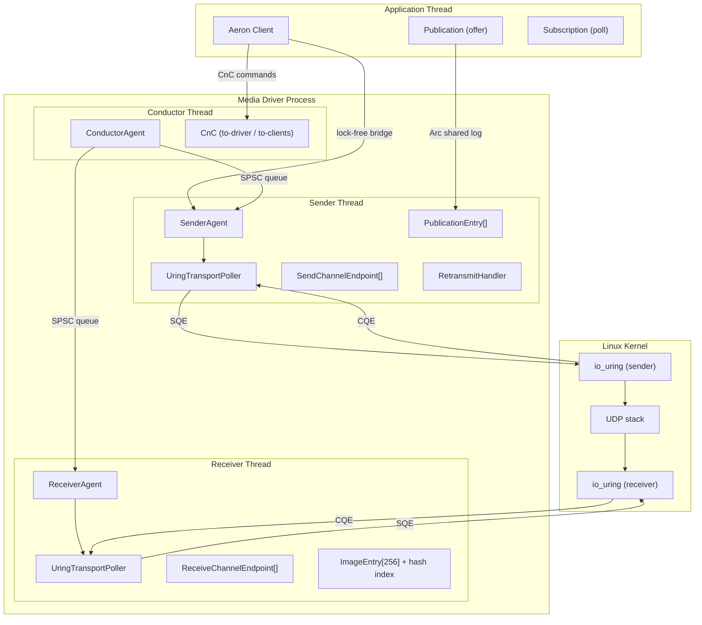

---

## 3. Module Map

```
src/
  lib.rs                    - Crate root, re-exports all modules
  clock.rs                  - NanoClock + CachedNanoClock (monotonic, cached)
  context.rs                - DriverContext (all configuration with validation)
  frame.rs                  - Wire protocol structs (repr(C, packed) overlays)

  agent/
    mod.rs                  - Agent trait + AgentError
    sender.rs               - SenderAgent (send data, heartbeat, RTTM, retransmit)
    receiver.rs             - ReceiverAgent (receive data, send SM/NAK)
    conductor.rs            - ConductorAgent (CnC command dispatch)
    runner.rs               - AgentRunner (duty cycle loop, threaded start/join)
    idle_strategy.rs        - BusySpin / Noop / Sleeping / Backoff idle strategies

  media/
    mod.rs                  - Sub-module declarations
    transport.rs            - UdpChannelTransport (socket setup, unicast/multicast)
    channel.rs              - UdpChannel (URI parser: aeron:udp?endpoint=...)
    poller.rs               - TransportPoller trait, PollError, RecvMessage, PollResult
    uring_poller.rs         - UringTransportPoller (io_uring, multishot, buf_ring)
    buffer_pool.rs          - SlotPool, RecvSlot, SendSlot (pinned, cache-aligned)
    term_buffer.rs          - RawLog + SharedLogBuffer (4-partition term buffer)
    network_publication.rs  - NetworkPublication (single-thread offer/scan)
    concurrent_publication.rs - ConcurrentPublication + SenderPublication (cross-thread)
    send_channel_endpoint.rs  - SendChannelEndpoint (send data/heartbeat/setup/RTTM)
    receive_channel_endpoint.rs - ReceiveChannelEndpoint (receive data, send SM/NAK)
    retransmit_handler.rs   - RetransmitHandler (NAK-driven delay/linger state machine)

  cnc/
    mod.rs                  - Sub-module declarations
    ring_buffer.rs          - MpscRingBuffer (lock-free, CAS-based)
    broadcast.rs            - BroadcastTransmitter/Receiver (to-clients)
    command.rs              - Wire-format command/response encode/decode
    cnc_file.rs             - DriverCnc + ClientCnc (anonymous mmap)

  client/
    mod.rs                  - ClientError, re-exports
    media_driver.rs         - MediaDriver (orchestrator, launches 3 agent threads)
    aeron.rs                - Aeron client (add_publication, add_subscription, heartbeat)
    bridge.rs               - PublicationBridge (lock-free SPSC slot transfer)
    publication.rs          - Publication (user-facing offer handle)
    subscription.rs         - Subscription (user-facing poll handle, data path stubbed)
```

---

## 4. Thread Model

The driver runs exactly 3 threads. No shared mutable state between them.

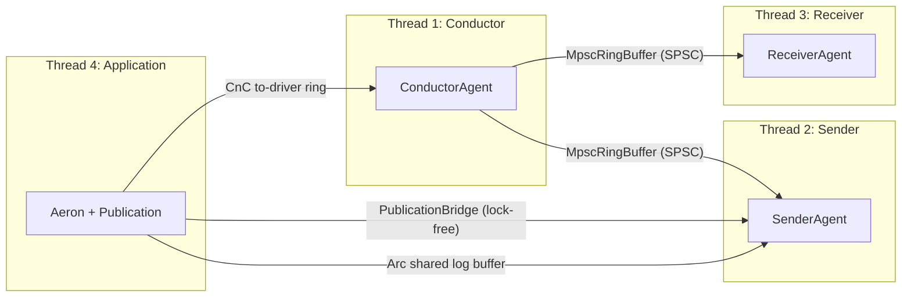

| Thread      | Agent          | io_uring ring | Purpose                                |
|-------------|----------------|---------------|----------------------------------------|
| Conductor   | ConductorAgent | None          | CnC command dispatch, client liveness  |
| Sender      | SenderAgent    | Own ring      | Send data/heartbeat/setup, recv SM/NAK |
| Receiver    | ReceiverAgent  | Own ring      | Recv data, send SM/NAK/RTTM            |
| Application | (user code)    | None          | offer() into shared log buffer         |

### Cross-Thread Communication

| From      | To        | Mechanism                                        | Hot path? |
|-----------|-----------|--------------------------------------------------|-----------|
| App       | Conductor | CnC to-driver MpscRingBuffer                     | No        |
| Conductor | App       | CnC to-clients BroadcastBuffer                   | No        |
| Conductor | Sender    | Internal MpscRingBuffer (SPSC)                   | No        |
| Conductor | Receiver  | Internal MpscRingBuffer (SPSC)                   | No        |
| App       | Sender    | PublicationBridge (Acquire/Release atomic slots) | Cold      |
| App       | Sender    | SharedLogBuffer (Arc, atomic frame_length)       | **Yes**   |

---

## 5. Agent Framework

All agents implement the `Agent` trait and run via `AgentRunner`.

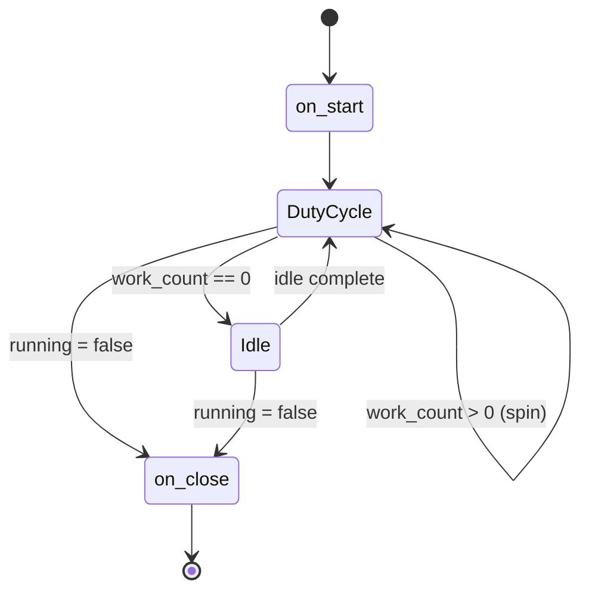

### Agent trait

```rust
pub trait Agent {
    fn name(&self) -> &str;
    fn do_work(&mut self) -> Result<i32, AgentError>;  // 0 = idle, >0 = busy
    fn on_start(&mut self) -> Result<(), AgentError> { Ok(()) }
    fn on_close(&mut self) -> Result<(), AgentError> { Ok(()) }
}
```

### IdleStrategy (enum dispatch, no dyn)

| Variant  | Behavior                                         |
|----------|--------------------------------------------------|
| BusySpin | `spin_loop()` hint, 100% CPU                     |
| Noop     | Do nothing (testing)                             |
| Sleeping | Fixed-duration park                              |
| Backoff  | 3-phase: spin N -> yield N -> park (ramp to max) |

### AgentRunner

- Generic over `A: Agent` (monomorphized, no trait objects)
- Shutdown via `Arc<AtomicBool>` with Acquire/Release ordering (not SeqCst)
- `start()` spawns a named thread, returns `AgentRunnerHandle` for stop/join

---

## 6. Sender Agent

**File:** `agent/sender.rs` (1106 lines)

The sender owns all send-side resources: one io_uring ring, all `SendChannelEndpoint`s, and all publications.

### Duty Cycle (`do_work`)

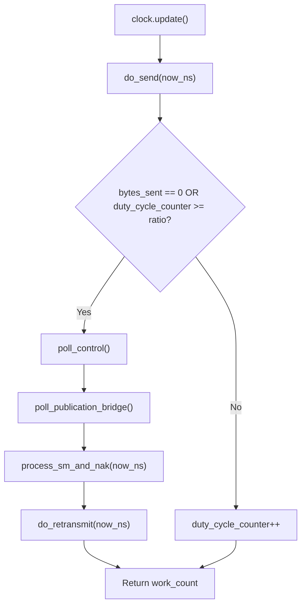

### do_send (per publication, round-robin)

1. Copy scalar fields from `PublicationEntry` (enum dispatch, no dyn)
2. Send setup frame if `needs_setup` and interval elapsed
3. Send heartbeat if idle for `heartbeat_interval_ns`
4. Send RTTM request if `rttm_interval_ns` elapsed
5. Flow-control clamp: `available = sender_limit - sender_position`
6. `sender_scan(limit, emit)` - walk committed frames, send via endpoint
7. `poller.flush()` - single `io_uring_enter`

### PublicationEntry (enum dispatch)

```rust
enum PublicationEntry {
    Local { publication: NetworkPublication, ... },
    Concurrent { sender_pub: SenderPublication, ... },
}
```

Both variants share identical field accessors via match-based dispatch. No `dyn`, no vtable. Common fields:
`endpoint_idx`, `dest_addr`, `needs_setup`, `sender_limit`, `last_rtt_ns`, timing fields.

### Flow Control

- `sender_limit` initialized to `term_length` (one full term window)
- Updated from SM: `proposed = consumption_position + receiver_window`
- Only advances forward (wrapping half-range check)
- RTT tracking: exponential moving average (SRTT = SRTT * 7/8 + sample * 1/8, shift-based)

---

## 7. Receiver Agent

**File:** `agent/receiver.rs` (1510 lines)

The receiver owns one io_uring ring, all `ReceiveChannelEndpoint`s, and all image entries.

### Duty Cycle (`do_work`)

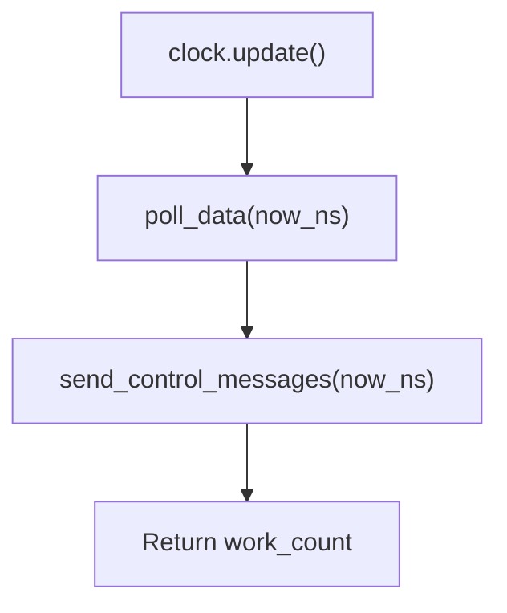

### Image Management

Images are stored in a pre-sized `[ImageEntry; 256]` flat array with an O(1) hash index:

- **Hash function:** multiply-xor on `(session_id, stream_id)` with bitmask (no modulo)
- **Collision resolution:** linear probing
- **Deletion:** backward-shift (no tombstones) - preserves O(1) average lookup
- **Per-image term buffer:** `Vec<Option<RawLog>>` parallel to images (allocated on setup)

### Data Frame Processing (`InlineHandler`)

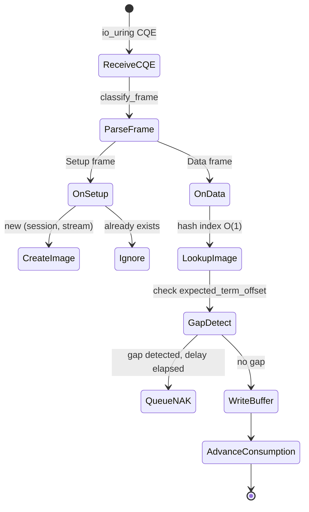

### Gap Detection and NAK

- Gap = `term_offset.wrapping_sub(expected_term_offset)` with half-range check
- Timer-based coalescing: one NAK per image per `nak_delay_ns`
- NAK queue: pre-sized `[PendingNak; 64]`, no allocation
- NAKs only generated for the active term (not past terms)
- Queue overflow: silently dropped (bounded)

### Term Rotation

When data arrives for a term ahead of `active_term_id`:

1. Clean all entering partitions between old and new active term
2. Update `active_term_id`, reset consumption tracking
3. Reject data for terms >= `PARTITION_COUNT` behind active

---

## 8. Conductor Agent

**File:** `agent/conductor.rs` (692 lines)

The conductor reads client commands from CnC and dispatches to sender/receiver via internal SPSC queues.

### Command Flow

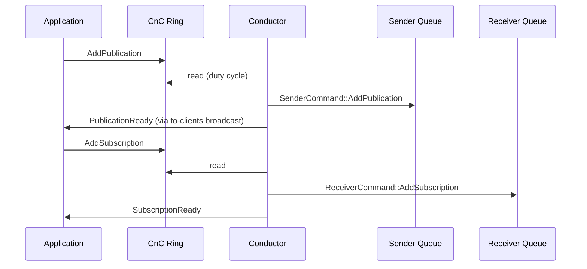

### Supported Commands

| Command            | Direction        | Handler                             |
|--------------------|------------------|-------------------------------------|
| AddPublication     | Client -> Driver | Alloc session_id, forward to sender |
| RemovePublication  | Client -> Driver | Forward to sender                   |
| AddSubscription    | Client -> Driver | Forward to receiver                 |
| RemoveSubscription | Client -> Driver | Forward to receiver                 |
| ClientKeepalive    | Client -> Driver | Update liveness table               |
| ClientClose        | Client -> Driver | (passive timeout)                   |

### Client Liveness

- `[ClientEntry; 64]` flat array with linear scan
- Tracked by `client_id` + `last_keepalive_ns`
- Timeout-based cleanup (configurable via `driver_timeout_ns`)

---

## 9. io_uring Transport Layer

### UringTransportPoller

**File:** `media/uring_poller.rs` (668 lines)

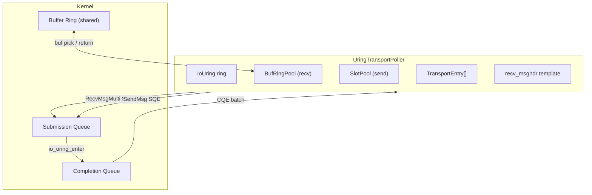

### Multishot Receive (zero re-arm)

One `RecvMsgMulti` SQE per transport stays active indefinitely. The kernel picks buffers from the shared `BufRingPool`.
No SQE re-submission per packet.

| Property          | Traditional RecvMsg          | Multishot + buf_ring          |
|-------------------|------------------------------|-------------------------------|
| SQEs per message  | 1 (re-arm each time)         | 0 (stays armed)               |
| Buffer management | Userspace pre-assigns        | Kernel picks from shared ring |
| Reap cost         | ~1100 ns (reap+rearm+submit) | ~14.8 ns (reap+recycle)       |

### BufRingPool

- Page-aligned ring entry array + cache-aligned buffer memory
- `return_buf_local()` accumulates returns, `publish_tail()` does a single Release store per batch
- Registered with kernel via `register_buf_ring_with_flags`

### UserData Encoding (64-bit CQE field)

```
[63..48] transport_idx  (16 bits)
[47..40] op_kind        (8 bits: OP_RECV=1, OP_SEND=2)
[39..24] slot_idx       (16 bits, send only)
[23..0]  reserved       (24 bits)
```

### CQE Processing

1. Harvest CQEs into stack buffer `[(u64, i32, u32); 256]` (4 KiB, L1-resident)
2. Decode UserData to determine operation type
3. For recv: parse `RecvMsgOut`, copy source addr to stack, invoke callback, return buffer
4. For send: free send slot
5. If multishot terminated (`!more`): re-submit RecvMsgMulti SQE
6. Single `publish_tail()` for all buf_ring returns
7. CQ overflow recovery: scan all send slots, free leaked InFlight entries

### SlotPool

**File:** `media/buffer_pool.rs`

- `RecvSlot`: 64-byte aligned, contains msghdr + iov + sockaddr_storage + 64 KiB buffer
- `SendSlot`: 64-byte aligned, contains msghdr + iov + sockaddr_storage (points to external data)
- `SlotState`: Free | InFlight
- Free list: `Vec<u16>` (indices), pre-sized at init, never resized
- `init_stable_pointers()` called once - kernel holds raw pointers afterward

---

## 10. Wire Protocol (frame.rs)

**File:** `frame.rs` (808 lines)

All wire frames use `#[repr(C, packed)]` overlay on little-endian targets. Compile-time guard rejects big-endian.

### Frame Types

| Type          | Code   | Size     | Purpose                                     |
|---------------|--------|----------|---------------------------------------------|
| Data          | 0x0001 | 32+ B    | Application data                            |
| Pad           | 0x0000 | 8+ B     | Term buffer padding                         |
| StatusMessage | 0x0003 | 36 B     | Consumer position + window                  |
| NAK           | 0x0002 | 28 B     | Loss notification                           |
| Setup         | 0x0005 | 40 B     | Stream initialization                       |
| RTTM          | 0x0006 | 40 B     | Round-trip time measurement                 |
| Heartbeat     | 0x0008 | 32 B     | Sender liveness (data frame with 0 payload) |
| Error         | 0x0004 | variable | Error notification                          |

### Header Hierarchy

```
FrameHeader (8 bytes) - common to all frames
  frame_length: i32
  version: u8
  flags: u8
  frame_type: u16

DataHeader (32 bytes) - extends FrameHeader
  + term_offset: i32
  + session_id: i32
  + stream_id: i32
  + term_id: i32
  + reserved_value: i64
```

### Parse Performance

| Operation          | Measured |
|--------------------|----------|
| FrameHeader::parse | ~0.3 ns  |
| DataHeader::parse  | ~0.4 ns  |
| classify_frame     | ~0.5 ns  |

---

## 11. Term Buffer and Publication

### RawLog (4-partition term buffer)

**File:** `media/term_buffer.rs` (1050 lines)

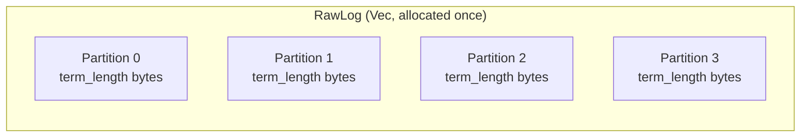

- **4 partitions** instead of Aeron's 3 (see ADR-001) - enables `& 3` bitmask
- `partition_index = (term_id.wrapping_sub(initial_term_id) as u32) & 3`
- `append_frame()`: write DataHeader + payload, 32-byte aligned, O(1)
- `scan_frames()`: walk frames by reading frame_length field-by-field (LE), O(n frames)
- `clean_partition()`: zero out on term rotation (cold path)

### NetworkPublication (single-thread)

**File:** `media/network_publication.rs` (794 lines)

Owns a `RawLog`. Provides the offer/scan API for same-thread use.

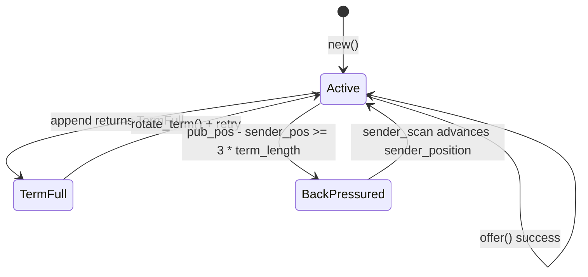

**Back-pressure:** `pub_position - sender_position >= (PARTITION_COUNT - 1) * term_length`

**Term rotation:** Clean the entering partition (not "N-1 ahead") - safe because back-pressure guarantees the sender
finished scanning that partition's previous contents.

---

## 12. Cross-Thread Publication

**File:** `media/concurrent_publication.rs` (1018 lines)

For client-to-sender cross-thread data flow. No Mutex, no SeqCst.

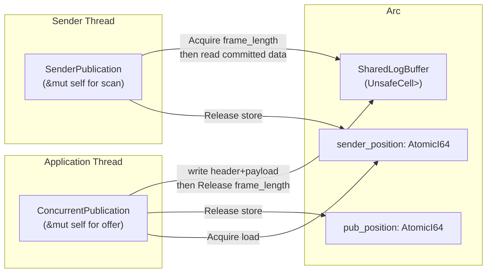

### Commit Protocol

1. Publisher writes header + payload bytes (non-atomic)
2. Publisher stores `frame_length` with **Release** ordering (commit barrier)
3. Scanner loads `frame_length` with **Acquire** ordering
4. If `frame_length > 0`: all preceding writes are visible

### Atomic Ordering Summary

| Field              | Writer    | Reader    | Ordering          |
|--------------------|-----------|-----------|-------------------|
| frame_length (buf) | Publisher | Sender    | Release / Acquire |
| pub_position       | Publisher | External  | Release / Acquire |
| sender_position    | Sender    | Publisher | Release / Acquire |

---

## 13. Client Library

**File:** `client/` module

### MediaDriver (orchestrator)

**File:** `client/media_driver.rs` (166 lines)

```rust
// Usage:
let driver = MediaDriver::launch(DriverContext::default ()) ?;
let mut aeron = driver.connect() ?;
let mut pub_h = aeron.add_publication("aeron:udp?endpoint=127.0.0.1:40123", 10) ?;
pub_h.offer(& [1, 2, 3, 4]) ?;
driver.close() ?;
```

`launch()` creates CnC, all 3 agents, and spawns them on dedicated threads. `connect()` returns an `Aeron` client handle
that shares the CnC region and publication bridge.

### Aeron Client

**File:** `client/aeron.rs` (322 lines)

| Method             | Description                                                                  |
|--------------------|------------------------------------------------------------------------------|
| `add_publication`  | Parse channel, create concurrent pub pair, open transport, deposit in bridge |
| `add_subscription` | Send command via CnC, return Subscription handle                             |
| `heartbeat`        | Pre-encoded keepalive, zero-alloc                                            |
| `is_driver_alive`  | Check driver heartbeat in CnC                                                |

### PublicationBridge

**File:** `client/bridge.rs` (142 lines)

Lock-free SPSC transfer of `PendingPublication` from client to sender:

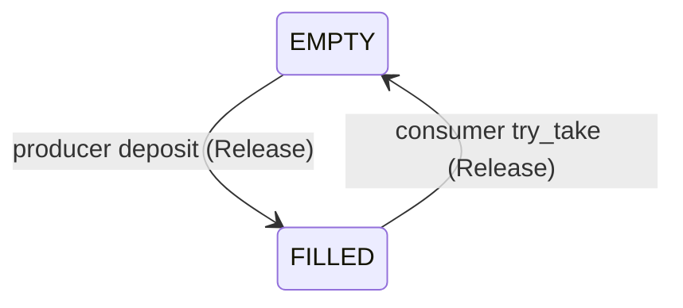

- 32 pre-allocated slots (cold-path deposit, cold-path take)
- Each slot: `AtomicU8` state + `UnsafeCell<Option<PendingPublication>>`
- In steady state: sender scans 32 Acquire loads per duty cycle (all miss = 32 cache line reads)

### Publication (user-facing handle)

**File:** `client/publication.rs` (137 lines)

Wraps `ConcurrentPublication`. Enforces single-publisher via `&mut self` on `offer()`. Not Clone. Send but not Sync.
Channel URI stored in inline `[u8; 256]` buffer (no String allocation).

### Subscription (stubbed)

**File:** `client/subscription.rs` (94 lines)

Registration works via CnC. Data path (`poll()`) requires shared-memory image buffers between receiver agent and
client - not yet implemented. Currently returns 0.

---

## 14. Command and Control (CnC)

**File:** `cnc/` module

### Components

| Component                       | Purpose                                         |
|---------------------------------|-------------------------------------------------|
| `MpscRingBuffer`                | Lock-free multi-producer ring buffer (CAS)      |
| `BroadcastTransmitter/Receiver` | One-to-many broadcast buffer                    |
| `DriverCnc`                     | Driver-side CnC handle (to-driver + to-clients) |
| `ClientCnc`                     | Client-side CnC handle (to-driver + to-clients) |
| `command.rs`                    | Wire-format encode/decode for all command types |

### Ring Layout

```
[CncHeader (256 B)][to-driver MpscRingBuffer (cap + 128 trailer)][to-clients BroadcastBuffer (cap + 128 trailer)]
```

CnC header: version (i32), PID (i32), to_driver_capacity (i32), to_clients_capacity (i32),
driver_heartbeat (i64, Release/Acquire). Version written last as "ready" signal.

Anonymous mmap for in-process use. File-backed mmap (`DriverCnc::create_file`) for cross-process IPC.
Both driver and client map the same region. Default capacity: 64 KiB per ring.

### Command Types

| Code | Name                | Direction        | Size  |
|------|---------------------|------------------|-------|
| 1    | ADD_PUBLICATION     | Client -> Driver | 280 B |
| 2    | REMOVE_PUBLICATION  | Client -> Driver | 24 B  |
| 3    | ADD_SUBSCRIPTION    | Client -> Driver | 280 B |
| 4    | REMOVE_SUBSCRIPTION | Client -> Driver | 24 B  |
| 5    | CLIENT_KEEPALIVE    | Client -> Driver | 16 B  |
| 6    | CLIENT_CLOSE        | Client -> Driver | 16 B  |

### Response Types

| Code | Name               | Direction        | Size  |
|------|--------------------|------------------|-------|
| 101  | PUBLICATION_READY  | Driver -> Client | 32 B  |
| 102  | SUBSCRIPTION_READY | Driver -> Client | 12 B  |
| 103  | OPERATION_ERROR    | Driver -> Client | 272 B |
| 104  | DRIVER_HEARTBEAT   | Driver -> Client | (hdr) |

---

## 15. Flow Control and Loss Recovery

### Sender-Side Flow Control

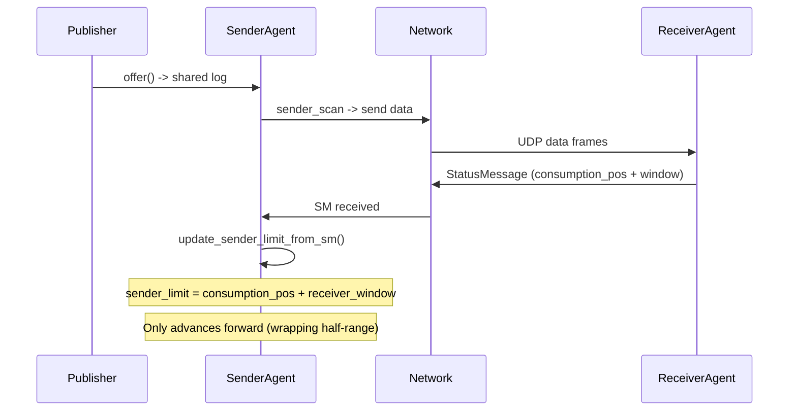

### Loss Recovery (NAK-driven)

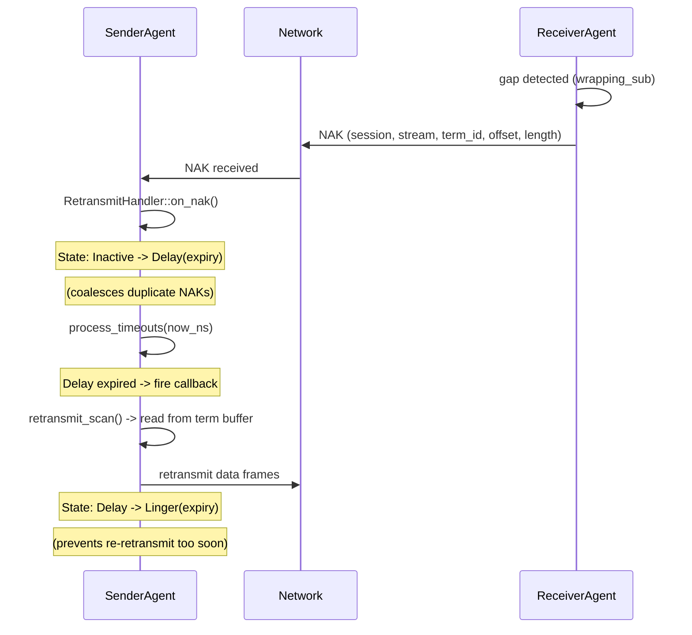

### RetransmitHandler State Machine

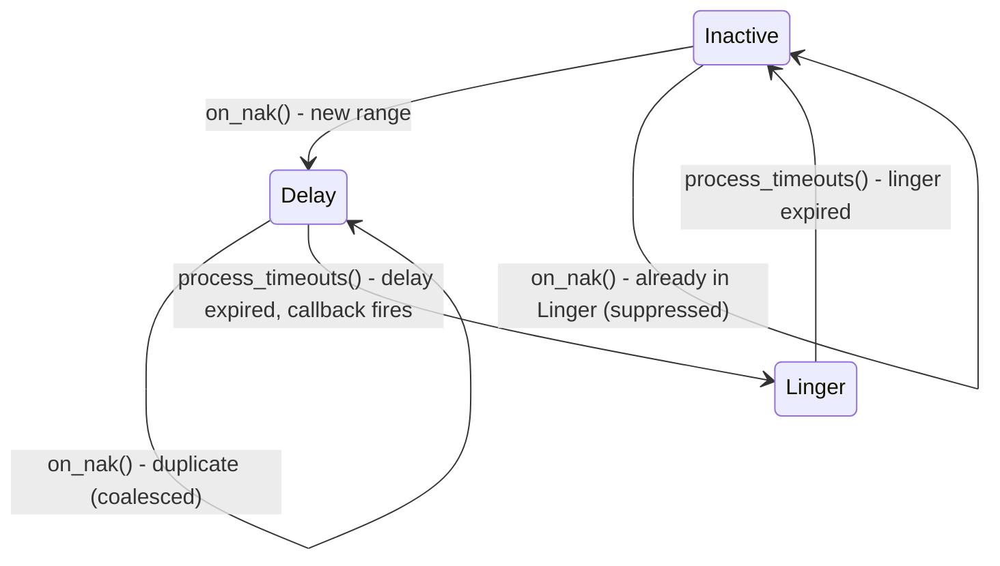

- Pre-sized `[RetransmitAction; 64]` flat array (~2.5 KiB, L1-resident)
- NAK range validation: position must be within `[sender_pos - 3*term_length, pub_pos)`
- Linear scan for dedup (n <= 64, acceptable)

### RTTM (Round-Trip Time Measurement)

- Sender periodically sends RTTM request (echo_timestamp = now_ns)
- Receiver echoes back with reception_delta
- Sender computes: `rtt_sample = now - echo_timestamp - reception_delta`
- SRTT update: `srtt = srtt * 7/8 + sample * 1/8` (shift-based, no division)

### Subscriber-Side Gap-Skip (ADR-002)

When retransmit fails (NAK lost, retransmit frame dropped, sender buffer overwritten), the subscriber must not stall
permanently. The subscriber detects gaps and skips past them to continue delivering subsequent data.

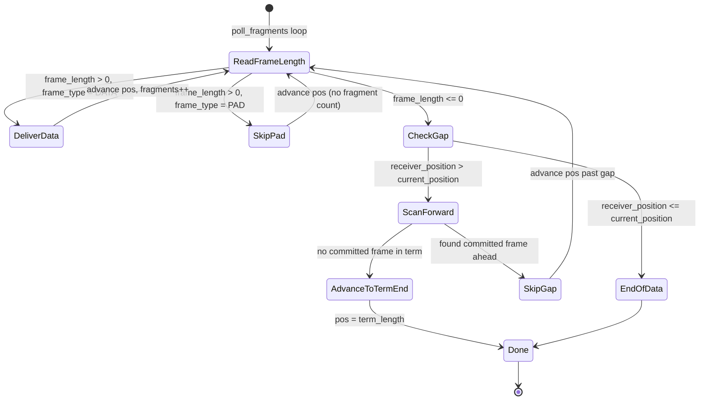

Three-layer loss recovery model (matches Aeron C/Java):

| Layer | Component | Status | Description |
|-------|-----------|--------|-------------|
| 1. Transport | NAK + RetransmitHandler | Implemented | Receiver detects gap, sends NAK, sender retransmits |
| 2. Subscriber | Gap-skip in poll_fragments | Implemented (ADR-002) | Subscriber detects unrecoverable gaps via receiver_position, scans forward |
| 3. Application | Loss handler callback | Not yet | Optional `on_loss(term_id, offset, length)` callback for app-level recovery |

---

## 16. Data Flow Diagrams

### Send Path (hot path)

```mermaid
flowchart LR
    A["Publication::offer()"] --> B["SharedLogBuffer write"]
    B --> C["atomic frame_length Release"]
    C --> D["SenderAgent::sender_scan()"]
    D --> E["atomic frame_length Acquire"]
    E --> F["SendChannelEndpoint::send_data()"]
    F --> G["SlotPool::alloc_send()"]
    G --> H["prepare_send() + SQE push"]
    H --> I["flush() - io_uring_enter"]
    I --> J["Kernel sendmsg"]
    J --> K["CQE -> free_send()"]
```

### Receive Path (hot path)

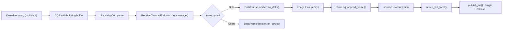

---

## 17. Key Design Decisions

| Decision                      | Rationale                                         | Reference                                            |
|-------------------------------|---------------------------------------------------|------------------------------------------------------|
| 4 term partitions (not 3)     | Enables `& 3` bitmask - no modulo in hot path     | [ADR-001](decisions/ADR-001-four-term-partitions.md) |
| io_uring multishot + buf_ring | Zero SQE re-arm per recv, ~14.8 ns vs ~1100 ns    | performance_design.md S7                             |
| Enum dispatch (no dyn)        | No vtable indirection in duty cycle               | copilot-instructions.md                              |
| PollError (stack-only)        | No heap alloc from std::io::Error                 | performance_design.md S11                            |
| Pre-sized flat arrays         | No HashMap, no Vec growth in steady state         | copilot-instructions.md                              |
| Wrapping arithmetic           | Handles i32 term_id wrap at MAX/MIN boundary      | performance_design.md S8                             |
| Release/Acquire (no SeqCst)   | Sufficient for single-writer patterns             | copilot-instructions.md                              |
| Backward-shift hash deletion  | No tombstones, preserves O(1) lookup average      | receiver.rs                                          |
| CachedNanoClock               | One clock read per duty cycle, cached for all ops | clock.rs                                             |
| compile_error on big-endian   | Wire format assumes LE, repr(C, packed) overlay   | frame.rs                                             |

---

## 18. Dependency Map

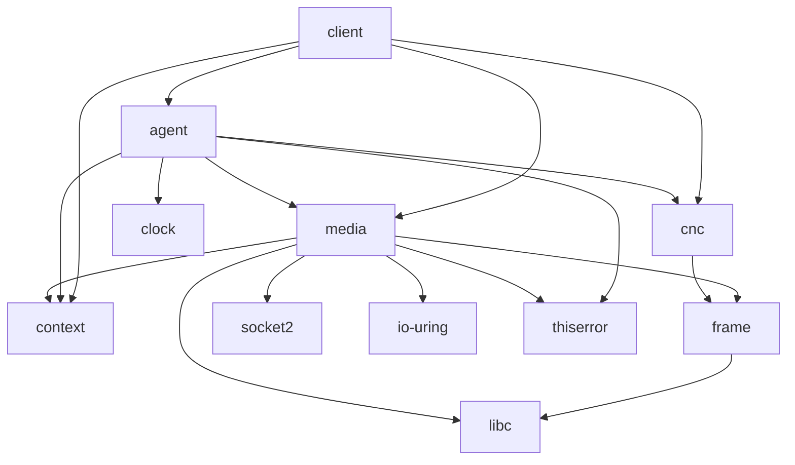

### External Crates

| Crate     | Version | Purpose                              |
|-----------|---------|--------------------------------------|
| io-uring  | 0.7     | io_uring ring, SQE/CQE, buf_ring     |
| libc      | 0.2     | msghdr, sockaddr, syscall constants  |
| socket2   | 0.6     | Socket creation, options, multicast  |
| thiserror | 2       | Error derive macros (cold path only) |
| tracing   | 0.1     | Structured logging                   |

---

## 19. File Inventory

| File                                | Lines        | Tests    | Purpose                         |
|-------------------------------------|--------------|----------|---------------------------------|
| `frame.rs`                          | 808          | 18       | Wire protocol structs + parse   |
| `clock.rs`                          | 110          | 5        | Monotonic + cached clock        |
| `context.rs`                        | 574          | 29+      | Driver configuration            |
| `agent/mod.rs`                      | 86           | 4        | Agent trait                     |
| `agent/sender.rs`                   | 1106         | 16       | Sender agent                    |
| `agent/receiver.rs`                 | 1510         | 30+      | Receiver agent                  |
| `agent/conductor.rs`                | 692          | 7        | Conductor agent                 |
| `agent/runner.rs`                   | 304          | 6        | Agent runner + thread lifecycle |
| `agent/idle_strategy.rs`            | 309          | 10       | Idle strategies                 |
| `media/uring_poller.rs`             | 668          | -        | io_uring transport poller       |
| `media/poller.rs`                   | 116          | -        | TransportPoller trait           |
| `media/transport.rs`                | 226          | -        | UDP socket transport            |
| `media/channel.rs`                  | 142          | -        | Channel URI parser              |
| `media/buffer_pool.rs`              | 401          | -        | Slot pool (pinned buffers)      |
| `media/term_buffer.rs`              | 1050         | 44       | RawLog + SharedLogBuffer        |
| `media/network_publication.rs`      | 794          | 32       | Single-thread publication       |
| `media/concurrent_publication.rs`   | 1018         | 30       | Cross-thread publication        |
| `media/send_channel_endpoint.rs`    | 560          | -        | Send endpoint                   |
| `media/receive_channel_endpoint.rs` | 529          | -        | Receive endpoint                |
| `media/retransmit_handler.rs`       | 370          | 11       | NAK retransmit scheduler        |
| `cnc/ring_buffer.rs`                | 628          | 11       | Lock-free ring buffer           |
| `cnc/broadcast.rs`                  | 504          | 8        | Broadcast buffer                |
| `cnc/command.rs`                    | 593          | 10       | Command encode/decode           |
| `cnc/cnc_file.rs`                   | 655          | 8        | CnC mmap layout                 |
| `client/media_driver.rs`            | 166          | -        | Driver orchestrator             |
| `client/aeron.rs`                   | 322          | 2        | Aeron client                    |
| `client/bridge.rs`                  | 142          | 3        | Publication bridge              |
| `client/publication.rs`             | 137          | -        | Publication handle              |
| `client/subscription.rs`            | 94           | -        | Subscription handle             |
| **Total**                           | **~14,500+** | **280+** |                                 |

---

## 20. Status and Gaps

### Implemented (v1)

- [x] Full wire protocol (Data, SM, NAK, Setup, RTTM, Heartbeat)
- [x] io_uring multishot receive with provided buffer ring
- [x] io_uring sendmsg with slot pool
- [x] Single-thread publication (offer + sender_scan)
- [x] Cross-thread publication (ConcurrentPublication + SenderPublication)
- [x] Sender agent (send, heartbeat, setup, RTTM, retransmit)
- [x] Receiver agent (receive, image management, SM/NAK generation)
- [x] Conductor agent (CnC command dispatch)
- [x] Client library (MediaDriver, Aeron, Publication)
- [x] Lock-free publication bridge
- [x] CnC ring buffers + broadcast
- [x] Flow control (sender_limit from SM)
- [x] Loss recovery (NAK-driven retransmit with delay/linger)
- [x] Subscriber gap-skip and pad frame handling (ADR-002)
- [x] RTT measurement (RTTM echo)
- [x] 3-phase idle strategy (spin/yield/park)
- [x] Subscription data path (SharedImage + SubscriptionBridge + Subscription::poll)

### Not Yet Implemented

- [ ] **Loss handler callback** - optional `on_loss()` callback in `poll_fragments` for app-level recovery (layer 3)
- [ ] **Receiver-side gap-fill** - receiver writes pad frames into gaps after retransmit timeout (reduces gap-skip scan)
- [ ] **Multi-destination cast (MDC)** - dynamic control mode, multiple destinations
- [ ] **Congestion control** - currently static receiver window
- [ ] **Counters file** - position limit counter, channel status indicator
- [ ] **Publication/subscription removal** - conductor forwards commands but sender/receiver do not yet process them
- [ ] **epoll fallback** - io_uring only (no older kernel support)
- [ ] **File-backed CnC** - currently anonymous mmap (in-process only)
- [ ] **Inter-process client** - requires file-backed CnC + shared memory logs

---

## 21. Configuration Tuning

The `DriverContext` struct exposes ~25 parameters that control socket buffers, io_uring sizing, sender/receiver timing,
idle strategy, and general behavior. Two pre-built tuning profiles are documented for common use cases:

| Profile | Goal | Key Changes | Expected Result |
|---------|------|-------------|-----------------|
| **Low-Latency** | Minimize RTT | `send_duty_cycle_ratio: 1`, `send_sm_on_data: true`, aggressive idle (100 spins, 10 us max park) | p50 ~5.8 us, p99 ~10.7 us |
| **High-Throughput** | Maximize msg/s | `uring_send_slots: 1024`, `term_buffer_length: 256 KiB`, `receiver_window: 256 KiB`, 4 MiB socket buffers | ~700K msg/s send rate |
| **SQPOLL** | Zero syscalls | `uring_sqpoll: true` (apply on top of either profile) | Eliminates ~66 ns io_uring_enter per flush |

For complete profiles with code snippets, parameter-by-parameter rationale, sizing formulas, trade-off analysis,
and Linux kernel tuning guidance, see [Configuration Tuning Guide](configuration_tuning.md).

