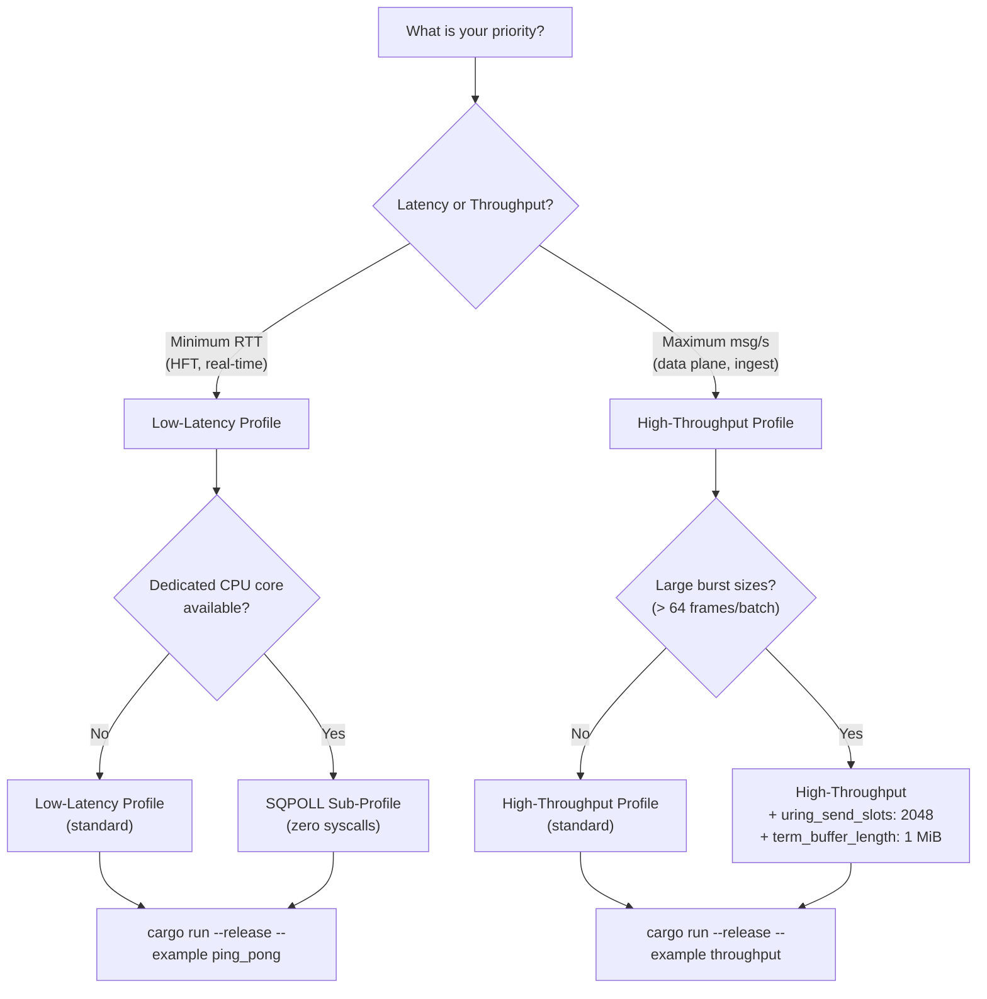
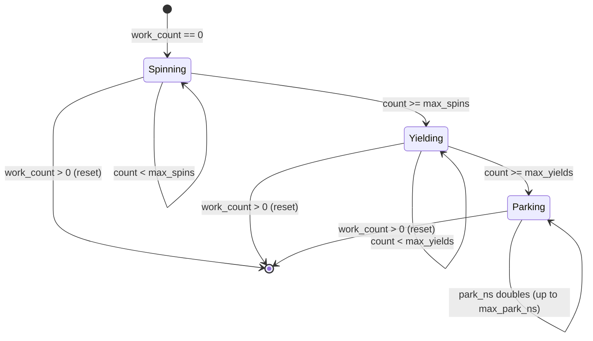
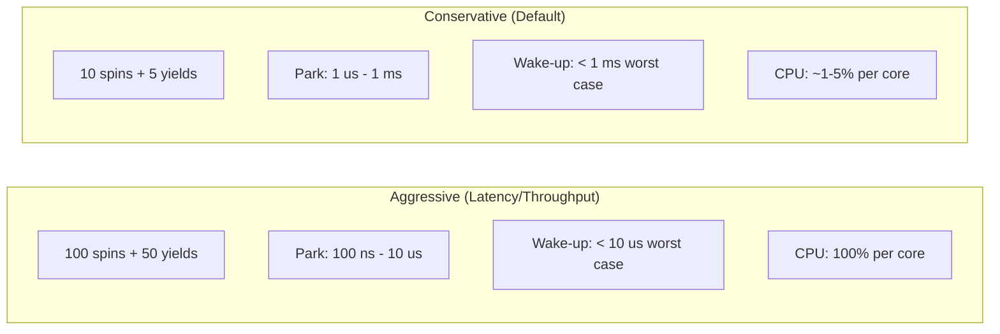

# Configuration Tuning Guide

> Practical tuning profiles for aeron-rs. Two primary use cases - **low-latency** and **high-throughput** -
> plus an optional **SQPOLL** sub-profile for zero-syscall operation.
>
> All code snippets use `..DriverContext::default()` delta style for maintainability.

---

## Table of Contents

- [Quick Decision Flowchart](#quick-decision-flowchart)
- [Profile Comparison Table](#profile-comparison-table)
- [Use Case 1: Low-Latency](#use-case-1-low-latency)
- [Use Case 2: High-Throughput](#use-case-2-high-throughput)
- [Use Case 3: SQPOLL (Zero-Syscall)](#use-case-3-sqpoll-zero-syscall)
- [Parameter Reference](#parameter-reference)
  - [Socket](#socket)
  - [io_uring](#io_uring)
  - [Sender Timing](#sender-timing)
  - [Receiver Timing](#receiver-timing)
  - [Idle Strategy](#idle-strategy)
  - [General](#general)
- [Trade-off Analysis](#trade-off-analysis)
- [Linux Kernel Tuning](#linux-kernel-tuning)
- [Validation](#validation)

---

## Quick Decision Flowchart



---

## Profile Comparison Table

| Parameter | Default | Low-Latency | High-Throughput | Unit |
|-----------|---------|-------------|-----------------|------|
| **Socket** | | | | |
| `socket_rcvbuf` | 2 MiB | 2 MiB | **4 MiB** | bytes |
| `socket_sndbuf` | 2 MiB | 2 MiB | **4 MiB** | bytes |
| `mtu_length` | 1408 | 1408 | 1408 | bytes |
| `multicast_ttl` | 0 | 0 | 0 | - |
| **io_uring** | | | | |
| `uring_ring_size` | 512 | 512 | **1024** | entries |
| `uring_recv_slots_per_transport` | 16 | 16 | 16 | slots |
| `uring_send_slots` | 128 | 128 | **1024** | slots |
| `uring_buf_ring_entries` | 256 | 256 | **512** | entries |
| `uring_sqpoll` | false | false (or **true**) | false | - |
| `uring_sqpoll_idle_ms` | 1000 | 1000 | 1000 | ms |
| **Sender Timing** | | | | |
| `heartbeat_interval_ns` | 100 ms | **5 ms** | **5 ms** | ns |
| `send_duty_cycle_ratio` | 4 | **1** | **1** | - |
| `term_buffer_length` | 64 KiB | 64 KiB | **256 KiB** | bytes |
| `retransmit_unicast_delay_ns` | 0 | 0 | 0 | ns |
| `retransmit_unicast_linger_ns` | 60 ms | 60 ms | 60 ms | ns |
| **Receiver Timing** | | | | |
| `sm_interval_ns` | 200 ms | **10 ms** | **10 ms** | ns |
| `nak_delay_ns` | 60 ms | 60 ms | 60 ms | ns |
| `rttm_interval_ns` | 1 s | 1 s | 1 s | ns |
| `max_receiver_images` | 256 | 256 | 256 | - |
| `receiver_window` | None | None | **Some(256 KiB)** | bytes |
| `send_sm_on_data` | false | **true** | **true** | - |
| **Idle Strategy** | | | | |
| `idle_strategy_max_spins` | 10 | **100** | **100** | iterations |
| `idle_strategy_max_yields` | 5 | **50** | **50** | iterations |
| `idle_strategy_min_park_ns` | 1 us | **100 ns** | **100 ns** | ns |
| `idle_strategy_max_park_ns` | 1 ms | **10 us** | **10 us** | ns |
| **General** | | | | |
| `driver_timeout_ns` | 10 s | 10 s | 10 s | ns |
| `timer_interval_ns` | 1 ms | 1 ms | 1 ms | ns |
| | | | | |
| **Expected Results** | | | | |
| RTT p50 | - | ~5.8 us | - | |
| RTT p99 | - | ~10.7 us | - | |
| Send rate | - | - | ~700K msg/s | |
| CPU usage (per agent) | ~1-5% | ~100% | ~100% | |

---

## Use Case 1: Low-Latency

**Goal:** Minimize round-trip time (RTT). Targets: p50 < 15 us, p99 < 50 us.

**Trade-off:** Burns 100% CPU on each agent core. 3 dedicated cores required (conductor + sender + receiver).

**Best for:** HFT market data, real-time control loops, latency-critical request-reply.

**Reference:** [examples/ping_pong.rs](../examples/ping_pong.rs)

```rust
use std::time::Duration;
use aeron_rs::context::DriverContext;

let ctx = DriverContext {
    // -- Sender: poll control messages every duty cycle (not every 4th). --
    // Reduces SM/NAK processing delay from ~4 cycles to ~1 cycle.
    // Cost: slightly more work per iteration when no control messages pending.
    send_duty_cycle_ratio: 1,

    // -- Fast heartbeat/SM for quick Setup handshake. --
    // Default 100 ms / 200 ms means session establishment takes 200-400 ms.
    // With 5 ms / 10 ms, first data flows within ~15-30 ms.
    heartbeat_interval_ns: Duration::from_millis(5).as_nanos() as i64,
    sm_interval_ns: Duration::from_millis(10).as_nanos() as i64,

    // -- Adaptive SM: receiver queues SM immediately on data receipt. --
    // Without this, sender_limit only advances on timer-based SM (every sm_interval_ns).
    // With send_sm_on_data, sender gets flow-control feedback per data burst,
    // reducing stalls where sender_limit blocks new sends.
    send_sm_on_data: true,

    // -- Aggressive idle strategy: minimize agent wake-up jitter. --
    // Default (10 spins, 5 yields, park 1 us - 1 ms) can add up to 1 ms
    // of wake-up latency when agents park during idle periods.
    //
    // Latency profile:
    //   100 spins (~30-50 ns each = 3-5 us of spinning)
    //   50 yields (~10-20 ns each = 0.5-1 us of yielding)
    //   park 100 ns - 10 us (vs default 1 us - 1 ms)
    //
    // This keeps agents responsive at the cost of 100% CPU per core.
    idle_strategy_max_spins: 100,
    idle_strategy_max_yields: 50,
    idle_strategy_min_park_ns: 100,    // 100 ns (vs default 1 us)
    idle_strategy_max_park_ns: 10_000, // 10 us (vs default 1 ms)

    ..DriverContext::default()
};
```

### Why Each Parameter Matters

| Parameter | Default | Latency | Why |
|-----------|---------|---------|-----|
| `send_duty_cycle_ratio` | 4 | 1 | Poll SM/NAK every cycle - sender_limit updates faster |
| `heartbeat_interval_ns` | 100 ms | 5 ms | Faster Setup handshake - first data within ~15 ms |
| `sm_interval_ns` | 200 ms | 10 ms | More frequent SM - sender_limit advances more often |
| `send_sm_on_data` | false | true | Immediate SM on data receipt - eliminates SM timer wait |
| `idle_strategy_max_spins` | 10 | 100 | Longer spin phase before yielding - catches incoming work faster |
| `idle_strategy_max_yields` | 5 | 50 | More yields before parking - avoids park/wake overhead |
| `idle_strategy_min_park_ns` | 1 us | 100 ns | Shorter minimum park - agent wakes up 10x faster |
| `idle_strategy_max_park_ns` | 1 ms | 10 us | Maximum park is 100x shorter - worst-case wake-up ~10 us vs ~1 ms |

### Expected Results (from ping_pong benchmark)

| Metric | Measured |
|--------|----------|
| p50 RTT | ~5.82 us |
| p90 RTT | ~6.46 us |
| p99 RTT | ~10.75 us |
| p99.9 RTT | ~26.56 us |
| avg RTT | ~6.10 us |

---

## Use Case 2: High-Throughput

**Goal:** Maximize messages per second. Target: >= 500K msg/s send rate (1408B MTU frames).

**Trade-off:** Higher memory usage (larger term buffers, more send slots, bigger socket buffers).
Burns 100% CPU on each agent core.

**Best for:** Data plane forwarding, telemetry ingestion, bulk streaming, log replication.

**Reference:** [examples/throughput.rs](../examples/throughput.rs)

```rust
use std::time::Duration;
use aeron_rs::context::DriverContext;

let ctx = DriverContext {
    // -- Large send slot pool: each sender_scan frame consumes one slot. --
    // Default 128 slots can starve when scanning a full term buffer
    // (e.g., 256 KiB / 1408 B = ~181 frames per term). With burst send,
    // multiple terms can be in-flight. 1024 slots covers ~5 full terms.
    uring_send_slots: 1024,

    // -- Larger io_uring ring to accommodate more in-flight SQEs. --
    // With 1024 send slots, the default 512-entry ring can fill up.
    // 1024 entries ensures SQE submission does not stall on ring full.
    uring_ring_size: 1024,

    // -- Larger provided buffer ring for burst recv absorption. --
    // Default 256 entries can exhaust under high inbound burst.
    // 512 entries gives 2x headroom before kernel drops to -ENOBUFS.
    uring_buf_ring_entries: 512,

    // -- Large socket buffers for burst absorption. --
    // Default 2 MiB handles moderate load. Under burst send/recv,
    // the kernel socket buffer fills and drops packets.
    // 4 MiB absorbs ~2800 MTU-sized frames (vs ~1400 at 2 MiB).
    // NOTE: requires net.core.wmem_max / rmem_max >= 4 MiB (see Linux Kernel Tuning).
    socket_sndbuf: 4 * 1024 * 1024,
    socket_rcvbuf: 4 * 1024 * 1024,

    // -- 256 KiB term buffer: 768 KiB back-pressure headroom. --
    // Default 64 KiB gives only 192 KiB total headroom (~136 MTU frames).
    // A burst of 128 frames nearly exhausts this in a single iteration.
    //
    // With 256 KiB per partition (x4 = 1 MiB per publication):
    //   back-pressure headroom = (4 - 1) * 256 KiB = 768 KiB (~545 frames)
    //   This absorbs larger bursts before back-pressure blocks the publisher.
    //
    // Memory cost: 1 MiB per publication (vs 256 KiB default).
    term_buffer_length: 256 * 1024,

    // -- Receiver window: 256 KiB covers 1 full term. --
    // Default (term_length / 2) restricts sender to ~22 frames per SM round-trip
    // at 64 KiB term_length, or ~90 frames at 256 KiB.
    //
    // Explicit 256 KiB window = ~181 MTU frames per SM round-trip.
    // This lets the sender sustain higher burst rates between SM acknowledgments.
    //
    // The window is advertised in each Status Message:
    //   sender_limit = consumption_position + receiver_window
    receiver_window: Some(256 * 1024),

    // -- Fast heartbeat/SM for quick Setup handshake. --
    heartbeat_interval_ns: Duration::from_millis(5).as_nanos() as i64,
    sm_interval_ns: Duration::from_millis(10).as_nanos() as i64,

    // -- Adaptive SM: queue SM immediately on data receipt. --
    // Critical for throughput: without this, sender_limit can stall for
    // up to sm_interval_ns (10 ms) between SM round-trips, limiting send rate.
    send_sm_on_data: true,

    // -- Poll control every duty cycle. --
    send_duty_cycle_ratio: 1,

    // -- Aggressive idle strategy (same as latency profile). --
    idle_strategy_max_spins: 100,
    idle_strategy_max_yields: 50,
    idle_strategy_min_park_ns: 100,
    idle_strategy_max_park_ns: 10_000,

    ..DriverContext::default()
};
```

### Why Each Parameter Matters

| Parameter | Default | Throughput | Why |
|-----------|---------|------------|-----|
| `uring_send_slots` | 128 | 1024 | More in-flight sends - sender_scan does not stall on slot exhaustion |
| `uring_ring_size` | 512 | 1024 | Accommodates 1024 send slots without SQE ring-full stalls |
| `uring_buf_ring_entries` | 256 | 512 | More recv buffers - reduces -ENOBUFS under burst recv |
| `socket_sndbuf` | 2 MiB | 4 MiB | Larger kernel send buffer - absorbs 2800 MTU frames |
| `socket_rcvbuf` | 2 MiB | 4 MiB | Larger kernel recv buffer - reduces packet drops |
| `term_buffer_length` | 64 KiB | 256 KiB | 768 KiB back-pressure headroom (vs 192 KiB) - absorbs larger bursts |
| `receiver_window` | None (32 KiB) | 256 KiB | 181 frames per SM round-trip (vs 22) - sender sustains higher rate |
| `send_sm_on_data` | false | true | Sender_limit advances immediately on data - reduces SM timer stalls |

### Sizing Guide

```
Frames per term = term_buffer_length / (DATA_HEADER_LENGTH + payload_size)
                = 262144 / (32 + 1376)
                = ~186 frames (MTU payload)

Back-pressure headroom = (PARTITION_COUNT - 1) * term_buffer_length
                       = 3 * 262144
                       = 786432 bytes (~545 MTU frames)

Frames per SM window = receiver_window / (DATA_HEADER_LENGTH + payload_size)
                     = 262144 / 1408
                     = ~186 frames per SM round-trip

Send slots needed = frames_per_scan_batch * duty_cycles_in_flight
                  = burst_size * 2..4 (safety margin)
```

### Expected Results (from throughput benchmark)

| Metric | Measured |
|--------|----------|
| Send rate | ~700K msg/s |
| Send bandwidth | ~1.0 GB/s |
| Recv rate (loopback) | ~211K msg/s (70% loss on UDP loopback under burst) |

> The 70% receive loss is expected on UDP loopback under burst load without kernel-side
> flow control. The primary metric is send rate (offer throughput). In production with
> real NICs and flow control, recv rate should closely track send rate.

---

## Use Case 3: SQPOLL (Zero-Syscall)

**Goal:** Eliminate `io_uring_enter` syscall from the duty cycle entirely.

**Trade-off:** Requires one additional dedicated CPU core for kernel-side SQ polling.
Total CPU cost: 4 cores (conductor + sender + receiver + SQPOLL kernel thread).

**Best for:** Ultra-low-latency scenarios where even a single syscall (~66 ns) per duty cycle matters.

Apply on top of either the Low-Latency or High-Throughput profile:

```rust
use aeron_rs::context::DriverContext;

let ctx = DriverContext {
    // Enable kernel-side SQ polling.
    // The kernel spawns a thread that polls the SQ ring continuously.
    // When SQEs are posted, the kernel thread picks them up without
    // userspace calling io_uring_enter(). This eliminates the ~66 ns
    // syscall overhead per flush().
    uring_sqpoll: true,

    // SQPOLL idle timeout: kernel thread parks after 1000 ms of no SQEs.
    // After parking, the next flush() triggers io_uring_enter() to wake it.
    // For steady-state messaging, the kernel thread stays active indefinitely.
    uring_sqpoll_idle_ms: 1000,

    // ... combine with Low-Latency or High-Throughput profile above ...
    ..DriverContext::default()
};
```

### SQPOLL Requirements

| Requirement | Details |
|-------------|---------|
| Kernel version | >= 5.19 (for buf_ring + SQPOLL) |
| Capability | `CAP_SYS_NICE` or `IORING_SETUP_SQPOLL` allowed |
| CPU core | 1 additional core for SQPOLL kernel thread |
| Affinity | Consider `taskset` to pin SQPOLL thread to a dedicated core |

### When NOT to Use SQPOLL

- CPU cores are scarce (< 4 available)
- Duty cycle already includes idle periods (SQPOLL thread wastes CPU during idle)
- System is power-constrained (SQPOLL spins at 100% CPU)

---

## Parameter Reference

### Socket

| Parameter | Type | Default | Constraint | Description |
|-----------|------|---------|------------|-------------|
| `socket_rcvbuf` | `usize` | 2 MiB | > 0 | SO_RCVBUF size. Kernel may cap at `net.core.rmem_max`. |
| `socket_sndbuf` | `usize` | 2 MiB | > 0 | SO_SNDBUF size. Kernel may cap at `net.core.wmem_max`. |
| `mtu_length` | `usize` | 1408 | [64, 65536] | Maximum frame size on wire. 1408 fits in standard Ethernet MTU (1500 - IP/UDP headers). |
| `multicast_ttl` | `u8` | 0 | - | IP_MULTICAST_TTL. 0 = system default. |

**Latency notes:** Default socket buffers are sufficient. Larger buffers add memory but do not reduce latency.

**Throughput notes:** Increase to 4+ MiB for burst absorption. Requires matching kernel `rmem_max` / `wmem_max`.

### io_uring

| Parameter | Type | Default | Constraint | Description |
|-----------|------|---------|------------|-------------|
| `uring_ring_size` | `u32` | 512 | Power-of-two, > 0 | SQ/CQ ring entries. Must be >= `uring_send_slots` for throughput. |
| `uring_recv_slots_per_transport` | `usize` | 16 | > 0 | Recv slot count per transport. Only used for traditional (non-multishot) mode. |
| `uring_send_slots` | `usize` | 128 | > 0 | Total pre-allocated send slots across all transports. Each in-flight sendmsg consumes one slot. |
| `uring_buf_ring_entries` | `u16` | 256 | Power-of-two, [1, 32768] | Provided buffer ring entries for multishot recv. Each entry is ~65 KiB. Memory: entries * 65 KiB. |
| `uring_sqpoll` | `bool` | false | - | Enable kernel-side SQ polling (eliminates io_uring_enter syscall). |
| `uring_sqpoll_idle_ms` | `u32` | 1000 | - | SQPOLL idle timeout before kernel thread parks. |

**Latency notes:** Default sizes are sufficient. Consider `uring_sqpoll: true` for zero-syscall operation.

**Throughput notes:** Scale `uring_send_slots` to match burst size. Scale `uring_ring_size` to match. `uring_buf_ring_entries` at 512-1024 for high inbound rates.

**Memory cost:** `uring_buf_ring_entries * 65 KiB` for recv buffers. Default 256 = ~16 MiB. 512 = ~32 MiB.

### Sender Timing

| Parameter | Type | Default | Constraint | Description |
|-----------|------|---------|------------|-------------|
| `heartbeat_interval_ns` | `i64` | 100 ms | > 0 | Interval between heartbeat frames per publication. Also affects Setup handshake speed. |
| `send_duty_cycle_ratio` | `usize` | 4 | > 0 | Ratio of send iterations to control-poll iterations. `1` = poll every cycle. `4` = poll every 4th cycle. |
| `term_buffer_length` | `u32` | 64 KiB | Power-of-two, >= 32 | Per-partition term buffer size. Total per publication = `term_buffer_length * 4` (ADR-001). |
| `retransmit_unicast_delay_ns` | `i64` | 0 | >= 0 | Delay before firing retransmit after NAK. 0 = immediate. |
| `retransmit_unicast_linger_ns` | `i64` | 60 ms | > 0 | Duration to suppress duplicate NAKs for the same range after retransmit. |

**Latency notes:** `send_duty_cycle_ratio: 1` ensures SM/NAK are processed immediately. `heartbeat_interval_ns: 5 ms` speeds up session establishment.

**Throughput notes:** `term_buffer_length: 256 KiB` (or larger) provides back-pressure headroom for burst sends. Back-pressure triggers when `pub_position - sender_position >= 3 * term_buffer_length`.

### Receiver Timing

| Parameter | Type | Default | Constraint | Description |
|-----------|------|---------|------------|-------------|
| `sm_interval_ns` | `i64` | 200 ms | >= 0 | Timer-based Status Message interval. 0 = disabled (only send_sm_on_data). |
| `nak_delay_ns` | `i64` | 60 ms | > 0 | Minimum interval between NAKs for the same image. Coalesces rapid gap detections. |
| `rttm_interval_ns` | `i64` | 1 s | > 0 | Round-trip time measurement request interval. |
| `max_receiver_images` | `usize` | 256 | [1, 256] | Maximum concurrent images (active sessions). Each allocates a RawLog. |
| `receiver_window` | `Option<i32>` | None | - | SM window override (bytes). None = `term_buffer_length / 2`. Determines how many frames sender can transmit per SM round-trip. |
| `send_sm_on_data` | `bool` | false | - | Queue SM immediately on data receipt (Aeron C `SEND_SM_ON_DATA`). Critical for both latency and throughput. |

**Latency notes:** `send_sm_on_data: true` is the single most impactful latency knob - sender_limit advances per data burst instead of per SM timer.

**Throughput notes:** `receiver_window` must be large enough to cover the sender's burst size between SM round-trips. Formula: `frames_per_window = receiver_window / frame_size`.

### Idle Strategy

| Parameter | Type | Default | Constraint | Description |
|-----------|------|---------|------------|-------------|
| `idle_strategy_max_spins` | `u64` | 10 | - | Spin iterations (cpu `spin_loop()` hint) before yielding. |
| `idle_strategy_max_yields` | `u64` | 5 | - | Yield iterations (`thread::yield_now()`) before parking. |
| `idle_strategy_min_park_ns` | `u64` | 1 us | > 0 | Minimum park (sleep) duration. |
| `idle_strategy_max_park_ns` | `u64` | 1 ms | >= min_park_ns | Maximum park duration (exponential backoff ceiling). |

**Three-phase backoff:**



**Latency notes:** More spins/yields + shorter parks = faster wake-up = lower tail latency. Cost: 100% CPU per agent core.

**Throughput notes:** Same aggressive settings recommended - agent responsiveness directly impacts send/recv throughput.

**Conservative (low CPU) alternative:**

```rust
// Low CPU usage profile - higher latency, lower power consumption.
// Suitable for non-latency-critical background data transfer.
idle_strategy_max_spins: 10,     // default
idle_strategy_max_yields: 5,     // default
idle_strategy_min_park_ns: 1_000,     // 1 us (default)
idle_strategy_max_park_ns: 1_000_000, // 1 ms (default)
// Worst-case wake-up latency: ~1 ms
// CPU usage per agent: ~1-5% (vs 100% for aggressive)
```

### General

| Parameter | Type | Default | Constraint | Description |
|-----------|------|---------|------------|-------------|
| `driver_timeout_ns` | `i64` | 10 s | > 0 | Client liveness timeout. Conductor marks client dead after this period without keepalive. |
| `timer_interval_ns` | `i64` | 1 ms | > 0 | General timer tick for periodic operations. |

These parameters are profile-independent. Adjust `driver_timeout_ns` only if your application has long idle periods between heartbeats.

---

## Trade-off Analysis

### Idle Strategy: CPU vs Wake-up Latency



The idle strategy is the **largest single factor** in tail latency. An agent parked for 1 ms (default max) adds 1 ms to the next message's processing time. Reducing max_park_ns to 10 us cuts worst-case wake-up latency by 100x.

### send_duty_cycle_ratio: Poll Frequency vs Batch Efficiency

| Ratio | Behavior | Latency Impact | Throughput Impact |
|-------|----------|----------------|-------------------|
| 1 | Poll control every duty cycle | Best - SM/NAK processed immediately | Good - no stale sender_limit |
| 4 (default) | Poll control every 4th cycle | +3 cycles SM delay | Slightly better batch efficiency |
| 8+ | Poll control rarely | Noticeable SM delay | Marginal batch improvement |

Recommendation: use `1` for both profiles. The cost of polling an empty CQ (no pending control messages) is negligible (~16 ns for stack CQE buffer init).

### receiver_window: SM Overhead vs Sender Stalls

The receiver window determines how many frames the sender can transmit between SM acknowledgments:

```
frames_per_window = receiver_window / frame_size

With default (term_length/2 = 32 KiB): 32768 / 1408 = ~23 frames
With 128 KiB:                          131072 / 1408 = ~93 frames
With 256 KiB:                          262144 / 1408 = ~186 frames
```

A small window causes the sender to stall frequently waiting for SM (sender_limit blocks). A large window allows longer bursts but increases memory usage and potential loss exposure.

### term_buffer_length: Memory vs Back-Pressure Headroom

```
Total memory per publication = term_buffer_length * PARTITION_COUNT (4)
Back-pressure headroom = (PARTITION_COUNT - 1) * term_buffer_length

64 KiB (default):  total 256 KiB,  headroom 192 KiB  (~136 frames)
256 KiB:           total 1 MiB,    headroom 768 KiB  (~545 frames)
1 MiB:             total 4 MiB,    headroom 3 MiB    (~2182 frames)
```

Larger term buffers absorb larger bursts before back-pressure blocks the publisher. The cost is proportional memory per publication.

---

## Linux Kernel Tuning

### Socket Buffer Limits

The kernel caps `SO_RCVBUF` / `SO_SNDBUF` at `net.core.rmem_max` / `net.core.wmem_max`. If your configured `socket_rcvbuf` / `socket_sndbuf` exceeds these limits, the kernel silently clamps to the max.

```sh
# Check current limits
sysctl net.core.rmem_max net.core.wmem_max

# Set to 8 MiB (persistent via /etc/sysctl.conf)
sudo sysctl -w net.core.rmem_max=8388608
sudo sysctl -w net.core.wmem_max=8388608
```

### CPU Isolation

For deterministic latency, isolate CPU cores for agent threads:

```sh
# Boot parameter (GRUB): isolate cores 2, 3, 4
GRUB_CMDLINE_LINUX="isolcpus=2,3,4 nohz_full=2,3,4 rcu_nocbs=2,3,4"

# Runtime: pin agent threads to isolated cores
taskset -c 2 ./sender_agent
taskset -c 3 ./receiver_agent
taskset -c 4 ./conductor_agent

# With SQPOLL: also reserve a core for the kernel polling thread
# The SQPOLL thread inherits the submitter's affinity
taskset -c 2,5 ./sender_agent  # core 5 for SQPOLL kernel thread
```

### io_uring SQPOLL Permissions

SQPOLL requires `CAP_SYS_NICE` or running as root:

```sh
# Option 1: capability
sudo setcap cap_sys_nice+ep ./target/release/my_app

# Option 2: sysctl (kernel >= 5.12)
sudo sysctl -w kernel.io_uring_sqpoll_only_root=0
```

### Transparent Huge Pages

Disable THP for deterministic latency (avoids compaction stalls):

```sh
echo madvise | sudo tee /sys/kernel/mm/transparent_hugepage/enabled
```

### Network Stack

```sh
# Increase UDP buffer queue length
sudo sysctl -w net.core.netdev_max_backlog=10000

# Disable timestamps (saves ~10 ns per packet)
sudo sysctl -w net.ipv4.tcp_timestamps=0

# Busy polling (complement to SQPOLL for recv path)
sudo sysctl -w net.core.busy_poll=50
sudo sysctl -w net.core.busy_read=50
```

---

## Validation

All `DriverContext` fields are validated at driver startup via `DriverContext::validate()`. The validation checks 18 constraints and returns a stack-only `ContextValidationError` (no heap allocation).

```rust
let ctx = DriverContext { /* ... */ };

// Validate before launching (MediaDriver::launch calls this internally).
ctx.validate().expect("invalid configuration");
```

Key constraints to remember:

| Constraint | Rule |
|------------|------|
| `uring_ring_size` | Must be power-of-two |
| `uring_buf_ring_entries` | Must be power-of-two, <= 32768 |
| `term_buffer_length` | Must be power-of-two, >= 32 |
| `idle_strategy_max_park_ns` | Must be >= `idle_strategy_min_park_ns` |
| `idle_strategy_min_park_ns` | Must be > 0 |
| `max_receiver_images` | Must be in [1, 256] |

For the full list, see [`context.rs`](../src/context.rs) `ContextValidationError` enum.

---

**See also:**
- [Performance Design](performance_design.md) - benchmark data, performance budgets, design principles
- [Architecture](ARCHITECTURE.md) - full system architecture, data flow, thread model
- [ADR-001](decisions/ADR-001-four-term-partitions.md) - 4-partition term buffer (bitmask indexing)
- [ADR-002](decisions/ADR-002-subscriber-gap-skip-loss-recovery.md) - subscriber gap-skip
- [examples/ping_pong.rs](../examples/ping_pong.rs) - latency profile in action
- [examples/throughput.rs](../examples/throughput.rs) - throughput profile in action

