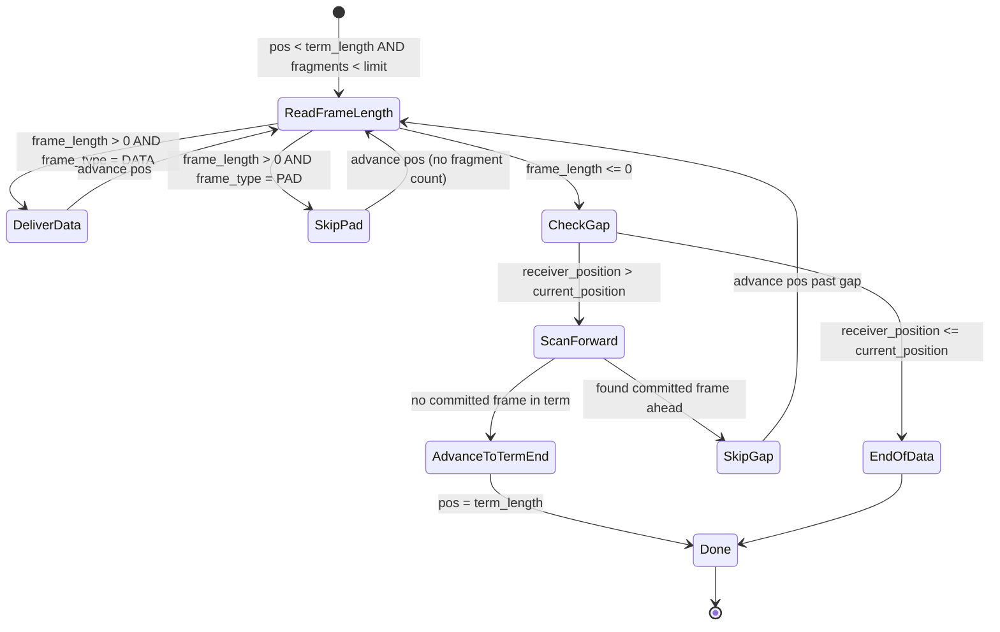

# ADR-002: Subscriber-Side Gap-Skip for Loss Recovery

**Date:** 2026-04-11  
**Status:** Accepted  
**Decision Date:** 2026-04-11  
**Deciders:** developer

## Context

The subscriber (`SubscriberImage::poll_fragments`) performs a linear forward scan through the shared image buffer,
reading committed frames via Acquire loads on `frame_length`. When it encounters `frame_length <= 0`, it breaks
unconditionally - treating any zero as "end of available data."

This causes two critical problems:

1. **Permanent stall on UDP packet loss.** When a single UDP packet is lost, the receiver writes subsequent frames at
   later offsets (out of order). The subscriber hits `frame_length == 0` at the gap position and stops. All frames
   written after the gap become permanently invisible. NAK + retransmit can fill the gap, but if the retransmit also
   fails (NAK lost, retransmit frame dropped, sender buffer overwritten), the subscriber is stuck forever.

2. **Missing `advance_receiver_position()` call.** `InlineHandler::on_data` in the receiver agent writes frames into
   the image via `recv_image.append_frame()` but never calls `recv_image.advance_receiver_position()`. The
   `receiver_position` atomic stays at its initial value forever. Without this signal, the subscriber cannot distinguish
   "gap in the middle of written data" from "genuine end of data."

3. **Pad frames delivered as data.** The publisher writes `FRAME_TYPE_PAD` frames at term boundaries when the remaining
   space cannot fit the next message. The subscriber delivered these as regular fragments to the application handler,
   which is incorrect.

These three issues combined caused the throughput example to report `received << sent` (subscriber stalled at the first
gap, typically within the first few milliseconds of data flow).

## Options Considered

### Option A: Subscriber-Side Gap-Skip

- **Description:** Fix `advance_receiver_position` in the receiver agent. In `poll_fragments`, when `frame_length <= 0`,
  check `receiver_position` (Acquire load) to detect gaps. If the receiver is ahead, scan forward to the next committed
  frame and skip the gap. Add `FRAME_TYPE_PAD` detection to silently advance past pad frames. Zero-allocation, no new
  data structures, subscriber-only change (plus the receiver position bug fix).
- **Pros:** Simple. Matches Aeron C subscriber behavior (lossy mode). No changes to the receiver duty cycle beyond the
  bug fix. Gap-skip is O(gap_size / FRAME_ALIGNMENT), bounded by term_length. Normal path remains O(1) per frame.
- **Cons:** Lost frames are silently skipped - no loss notification to the application. Gap scan is O(n) in gap size (not
  O(1)), though bounded and rare.
- **Effort:** Low

### Option B: Receiver-Side Gap-Fill with Pad Frames

- **Description:** The receiver agent detects gaps (already does via `expected_term_offset`), starts a timer, and after
  a configurable timeout writes `FRAME_TYPE_PAD` frames into the gap positions. The subscriber sees a contiguous stream
  of data + pad frames and never encounters a zero in the middle of committed data.
- **Pros:** Subscriber stays simple (no gap detection). Guarantees contiguous frame stream. Enables precise loss
  accounting (pad frames mark exact loss positions).
- **Cons:** Adds complexity to the receiver duty cycle (gap tracking per image, timer management, pad write logic).
  Multiple concurrent gaps per image require a tracking data structure. Adds writes to the receiver hot path on timeout.
- **Effort:** Medium

### Option C: Do Nothing (Status Quo)

- **Description:** Keep the current behavior. Document that `Subscription::poll()` does not handle gaps.
- **Pros:** No code change. No risk.
- **Cons:** Subscriber permanently stalls on any packet loss. The throughput example is effectively broken. The subscribe
  data path is unusable for any real workload.
- **Effort:** None

## Decision

**Chosen: Option A - Subscriber-Side Gap-Skip**

Fix the `advance_receiver_position` bug in the receiver agent and implement subscriber-side gap detection + skip in
`poll_fragments`. Add `FRAME_TYPE_PAD` detection to skip pad frames without delivering to the handler.

Option B (receiver-side gap-fill) is a valid future enhancement that can be layered on top. It would reduce loss further
by giving the subscriber a contiguous stream, but Option A is sufficient to unblock the data path and matches Aeron C's
lossy subscriber model.

## Rationale

- **Aeron C precedent.** Aeron C/Java implements a 3-layer loss recovery model: (1) NAK + retransmit at the transport
  layer, (2) gap-skip + loss handler at the subscriber layer, (3) application-level recovery. Layer 1 was already
  implemented in aeron-rs. This ADR implements layer 2 (gap-skip, without the loss handler callback for now).

- **Zero-allocation in steady state.** The gap-skip scan uses only stack variables. No Vec growth, no HashMap, no
  allocation. The scan walks FRAME_ALIGNMENT-aligned offsets with atomic loads - the same pattern used by `scan_frames`
  in the sender.

- **Bounded scan cost.** The gap scan is at most `term_length / FRAME_ALIGNMENT` iterations (2048 for a 64 KiB term).
  Each iteration is a single Acquire atomic load. This only executes on gap detection (exceptional path), not per-frame.
  Normal path remains O(1) per frame with zero additional overhead.

- **receiver_position fix is prerequisite.** Without the receiver position bug fix, the subscriber has no way to
  distinguish "gap" from "end of data." The Acquire load of `receiver_position` in the gap check adds one atomic load
  per gap detection - negligible overhead since it only triggers on `frame_length <= 0`.

- **Pad frame handling is orthogonal but related.** The publisher writes pad frames at term boundaries. Without pad
  detection, the subscriber either delivers them as nonsensical fragments or stalls at the term boundary. Adding pad
  detection was a necessary complement to the gap-skip work.

## Consequences

### Positive

- Subscriber no longer stalls on UDP packet loss - data flow continues past gaps.
- Throughput example now shows meaningful receive rates (~70% delivery under burst load on loopback).
- Pad frames at term boundaries are correctly handled (skipped without delivery).
- `receiver_position` now reflects the actual high-water mark, enabling correct back-pressure.

### Negative

- Lost frames are silently skipped. No loss notification callback to the application (future work).
- Gap scan cost is O(gap_size / 32), not O(1). Worst case 2048 atomic loads per term. Acceptable for exceptional path.
- Gap-skip without receiver-side gap-fill means retransmit failures are permanent losses. The subscriber will never
  recover frames that fail retransmit - it skips them.

### Neutral

- Wire protocol unchanged. No impact on interop with Aeron C/Java peers.
- NAK + retransmit mechanism unchanged. Gap-skip is complementary, not a replacement.
- Back-pressure formula unchanged (`max_ahead = term_length * (PARTITION_COUNT - 1)`).

### Observed Outcomes (post-implementation)

- **Throughput example results:**
  - Send rate: ~592 K msg/s (PASS, exceeds 500K target)
  - Recv rate: ~424 K msg/s (~72% delivery)
  - Loss: ~28% (UDP loopback under burst load, expected)
  - Before fix: subscriber stalled within first few ms, received << sent

- **Gap-skip flow:** When `frame_length <= 0` at subscriber position:
  1. Acquire load of `receiver_position` from `ImageInner`
  2. If `receiver_position <= subscriber_position`: break (normal end of data)
  3. If `receiver_position > subscriber_position`: gap detected - scan forward
  4. Scan: walk FRAME_ALIGNMENT offsets, Acquire load `frame_length` at each
  5. First `frame_length > 0` found: skip gap, continue delivering
  6. No committed frame found in term: advance to term boundary, next poll handles next term

- **Pad frame flow:** After validating `frame_length > 0`:
  1. Read `frame_type` from buffer offset +6 (field-by-field little-endian decode)
  2. If `FRAME_TYPE_PAD`: advance `pos` and `bytes_scanned`, do not call handler, do not increment `fragments`
  3. Position advances past pad - subscriber proceeds to next frame or term

## Affected Components

| Component | Impact | Lines | Tests | Description |
|-----------|--------|-------|-------|-------------|
| `media/shared_image.rs` | High | 1078 | 19 | `SubscriberImage::poll_fragments` rewritten with gap-skip scan, pad frame detection, and `receiver_position` check. 6 new tests: gap_skip_single_frame_gap, gap_skip_advances_to_term_boundary, gap_skip_multiple_gaps, no_gap_skip_when_receiver_not_ahead, pad_frame_skipped_without_delivery, pad_frame_between_data_frames. |
| `agent/receiver.rs` | Medium | 2134 | 37 | `InlineHandler::on_data` now calls `recv_image.advance_receiver_position()` after successful `append_frame`. Position computed as `term_count * term_length + new_offset`, only advances forward (wrapping-safe half-range comparison). Removed `#[allow(dead_code)]` from `ImageEntry::term_length`. 3 new tests: on_data_advances_receiver_position, on_data_receiver_position_monotonically_increases, on_data_receiver_position_advances_across_terms. |
| `examples/throughput.rs` | Low | 248 | - | Updated module doc to reflect gap-skip behavior. Removed outdated "stalls at first term boundary gap" note. |

## Future Work

- **Loss handler callback.** Add an optional `on_loss(term_id, term_offset, length)` callback to `poll_fragments` so
  applications can track and recover from loss. Matches `aeron_loss_reporter_t` in Aeron C.
- **Receiver-side gap-fill (Option B).** After retransmit timeout, the receiver writes pad frames into gaps. This
  reduces the subscriber's gap-skip scan to zero (contiguous frame stream). Requires gap tracking per image in the
  receiver agent.
- **Gap scan limit.** Add a configurable cap on gap-scan iterations per `poll_fragments` call to bound worst-case
  latency. If the cap is hit, the subscriber advances to the term boundary.

## Compliance Checklist

- [x] Code reflects decision
- [x] Tests updated (9 new tests: 6 in shared_image, 3 in receiver)
- [x] Documentation updated (this ADR, throughput example docs)
- [x] Superseded ADRs updated (N/A - no prior ADR)

## Revision History

| Date | Change | Author |
|------|--------|--------|
| 2026-04-11 | Initial draft - subscriber gap-skip, pad frame handling, receiver_position fix | developer |

