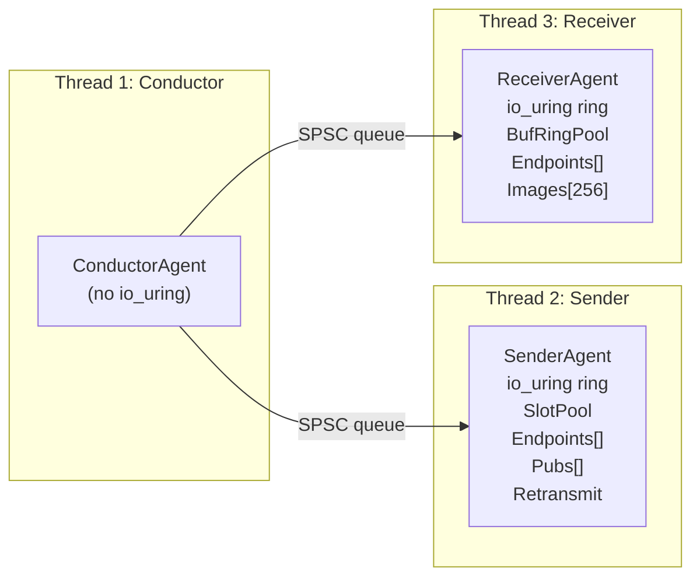
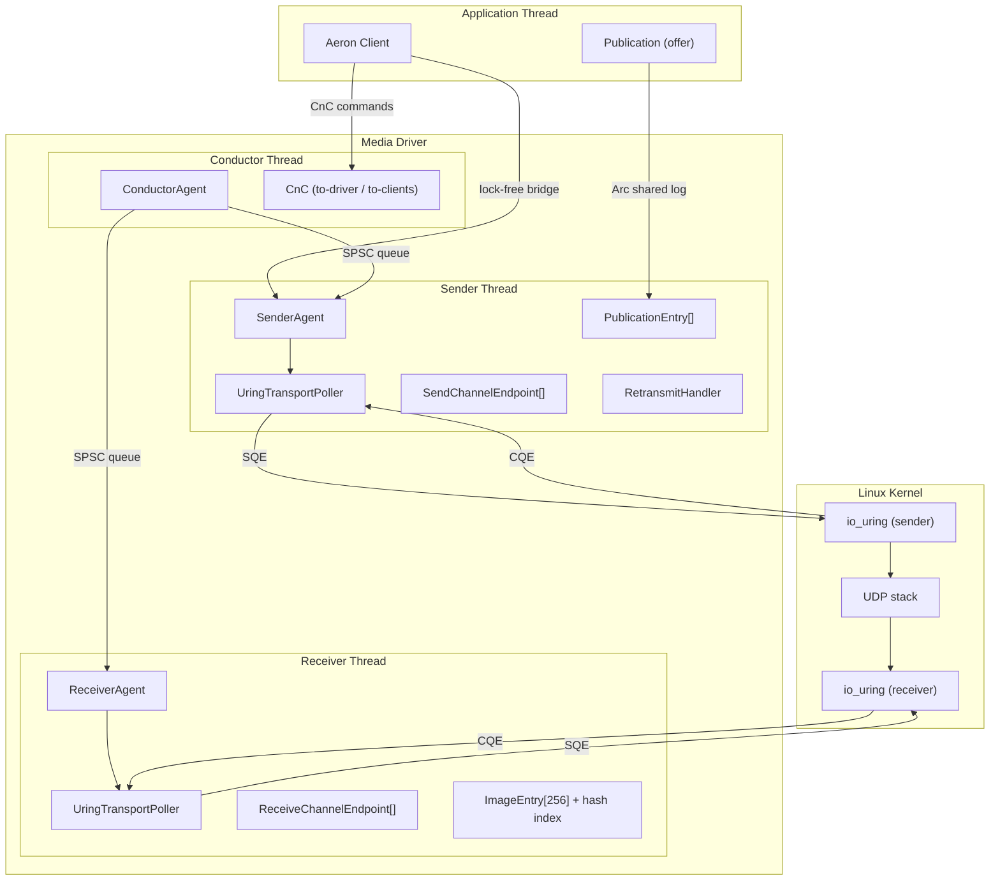
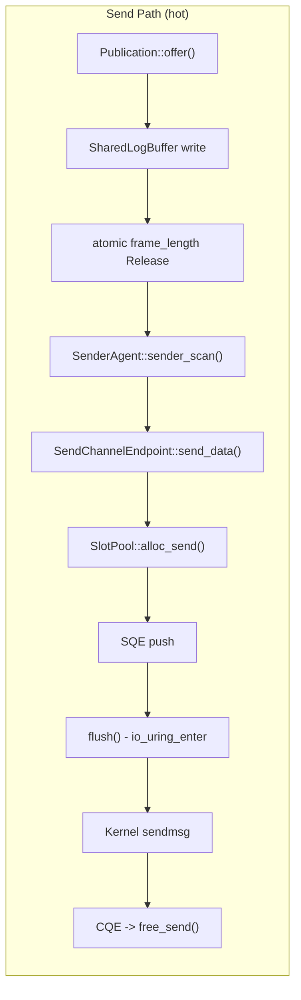
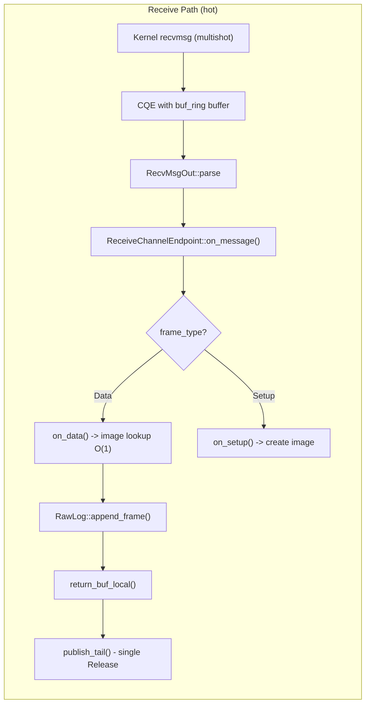

# Performance Design

> **Zero-copy, io_uring-native Aeron media driver in Rust.**
>
> [!] If a change triggers allocation in steady state, moves a pinned buffer, or adds a syscall in the duty cycle -
> **REJECT**.

---

## Table of Contents

- [Project Overview](#project-overview)
- [Governance Model](#governance-model)
- [Deployment Assumptions](#deployment-assumptions)
- [Performance Targets](#performance-targets)
- [Core Design Principles](#core-design-principles)
    - [1. Determinism First](#1-determinism-first)
    - [2. Zero-Copy I/O via io_uring](#2-zero-copy-io-via-io_uring)
    - [3. Allocation-Free Hot Path](#3-allocation-free-hot-path)
    - [4. Single-Threaded Agent Model](#4-single-threaded-agent-model)
    - [5. Cache-Oriented Design](#5-cache-oriented-design)
    - [6. Pinned Memory & Slot Lifecycle](#6-pinned-memory--slot-lifecycle)
    - [7. Multishot Receive with Provided Buffer Ring](#7-multishot-receive-with-provided-buffer-ring)
    - [8. Sequence & Term Arithmetic](#8-sequence--term-arithmetic)
    - [9. Ring Buffer Discipline](#9-ring-buffer-discipline)
    - [10. Wire Format (Little-Endian)](#10-wire-format-little-endian)
    - [11. Error Handling in Hot Path](#11-error-handling-in-hot-path)
    - [12. Dispatch & Polymorphism](#12-dispatch--polymorphism)
    - [13. Unsafe Policy](#13-unsafe-policy)
    - [14. Performance Budget](#14-performance-budget)
    - [15. Term Buffer & Publication Layer](#15-term-buffer--publication-layer)
    - [16. CnC, Conductor, and Client Library](#16-cnc-conductor-and-client-library)
- [Architecture Overview](#architecture-overview)
- [Final Principle](#final-principle)

---

## Project Overview

### Target Domains

| Domain                          | Use Case                               |
|---------------------------------|----------------------------------------|
| HFT (High-Frequency Trading)    | Ultra-low latency market data / orders |
| Real-time telemetry             | Sensor data ingestion at scale         |
| Latency-critical infrastructure | Distributed systems messaging (Aeron)  |
| High-throughput data planes     | > 3 M msg/s on commodity hardware      |

### Inspiration

| Source               | Contribution                                   |
|----------------------|------------------------------------------------|
| Aeron (Real Logic)   | Wire protocol, agent model, term buffer design |
| io_uring             | Syscall-free I/O, provided buffer rings        |
| Mechanical Sympathy  | Hardware-aware, cache-local data structures    |
| Aeron C media driver | Reference latency floor (~40-80 ns offer path) |

---

## Governance Model

This project defines **two layers** of performance governance:

| Layer            | Document                          | Purpose                       |
|------------------|-----------------------------------|-------------------------------|
| **Architecture** | `docs/performance_design.md`      | Defines intent and reasoning  |
| **Enforcement**  | `.github/copilot-instructions.md` | Enforces non-negotiable rules |

### Conflict Resolution

```
If enforcement rules conflict with architecture
    → Architecture must be updated first

Benchmarks are the final authority.
```

### Auto-Reject Rules (Enforced)

```
[x] Mutex / RwLock in agent duty cycle
[x] HashMap in hot path - use pre-sized flat array + index
[x] % (modulo) for ring / term index - use & (capacity - 1)
[x] unwrap() / expect() in parsing or CQE handling
[x] Trait object (dyn) in duty cycle - monomorphize or enum dispatch
[x] Allocation (Vec::push growth, Box, String, format!) inside duty cycle
[x] Sequence comparison using > or < - use wrapping_sub + half-range
[x] Vec resize / realloc while io_uring slots are in-flight
[x] Pointer cast for wire format parsing - use from_le_bytes or repr(C, packed)
[x] Host-endian assumption in protocol frames
[x] SeqCst atomic ordering in hot path
[x] std::io::Error construction in hot path (heap-allocates)
```

---

## Deployment Assumptions

| Assumption           | Value                                               |
|----------------------|-----------------------------------------------------|
| Primary target       | x86_64 Linux (kernel >= 5.19 for buf_ring)          |
| Wire format          | **Little-endian (Aeron protocol)**                  |
| I/O model            | **io_uring** (no epoll/select fallback in hot path) |
| Thread model         | One thread per agent - no shared mutable state      |
| Cluster architecture | Same-architecture expected                          |
| Priority             | Deterministic latency > cross-platform portability  |

> [!] **Note**: Big-endian targets are rejected at compile time (`compile_error!` in `frame.rs`). Cross-endian support
> would require a versioned protocol change.

---

## Performance Targets

### Userspace Operations

| Metric                       | Target   | Measured | Status |
|------------------------------|----------|----------|--------|
| FrameHeader::parse           | < 5 ns   | ~0.3 ns  | PASS   |
| DataHeader::parse            | < 5 ns   | ~0.4 ns  | PASS   |
| classify_frame               | < 5 ns   | ~0.5 ns  | PASS   |
| SlotPool alloc + free        | < 10 ns  | ~3.0 ns  | PASS   |
| SQE push (alloc + prepare)   | < 10 ns  | ~3.8 ns  | PASS   |
| Heartbeat build + submit     | < 15 ns  | ~4.5 ns  | PASS   |
| CQE dispatch (single msg)    | < 50 ns  | ~13.7 ns | PASS   |
| NAK build + write            | < 10 ns  | ~1.5 ns  | PASS   |
| Loss scan (16 frames, 1 gap) | < 200 ns | ~0.7 ns  | PASS   |
| Gap detection (wrapping sub) | < 5 ns   | ~0.4 ns  | PASS   |
| CachedNanoClock::cached      | < 1 ns   | ~0.2 ns  | PASS   |

### io_uring Kernel Roundtrip

| Metric                        | Target   | Measured | Status |
|-------------------------------|----------|----------|--------|
| NOP submit + reap (single)    | < 500 ns | ~163 ns  | PASS   |
| NOP submit + reap (burst 16)  | < 1 us   | ~371 ns  | PASS   |
| UDP sendmsg + reap            | < 2 us   | ~874 ns  | PASS   |
| Multishot recv reap + recycle | < 50 ns  | ~14.8 ns | PASS   |
| submit() empty ring (syscall) | < 200 ns | ~65.1 ns | PASS   |
| SQE push only (no submit)     | < 50 ns  | ~31.4 ns | PASS   |

### Publication & Scan Path

| Metric                                     | Target   | Measured  | Status |
|--------------------------------------------|----------|-----------|--------|
| NetworkPublication::offer (empty payload)  | < 15 ns  | ~8.6 ns   | PASS   |
| NetworkPublication::offer (64B payload)    | < 15 ns  | ~10.2 ns  | PASS   |
| NetworkPublication::offer (1KiB payload)   | < 50 ns  | ~31.5 ns  | PASS   |
| sender_scan (1 frame)                      | < 15 ns  | ~9.6 ns   | PASS   |
| sender_scan (batch 16 frames)              | < 200 ns | ~148.1 ns | PASS   |
| offer 64B + sender_scan (combined)         | < 20 ns  | ~10.0 ns  | PASS   |

### Subscriber Poll Path

| Metric                                     | Target   | Measured  | Status |
|--------------------------------------------|----------|-----------|--------|
| poll_fragments (empty - no data)           | < 5 ns   | ~1.4 ns   | PASS   |
| poll_fragments (single frame)              | < 15 ns  | ~9.4 ns   | PASS   |
| poll_fragments (batch 16 frames)           | < 200 ns | ~121.8 ns | PASS   |
| poll_fragments (batch 64 frames)           | < 700 ns | ~548.7 ns | PASS   |
| poll_fragments (gap skip, 1 gap in 16)     | < 100 ns | ~73.6 ns  | PASS   |
| poll_fragments (pad frame skip)            | < 100 ns | ~51.9 ns  | PASS   |
| poll_fragments (single frame 64B payload)  | < 20 ns  | ~14.0 ns  | PASS   |

### Duty Cycle

| Metric                       | Target   | Measured   | Status |
|------------------------------|----------|------------|--------|
| Sender idle                  | < 5 us   | ~1.75 us   | PASS   |
| Sender 1 frame               | < 10 us  | ~3.42 us   | PASS   |
| Sender 16 frames             | < 50 us  | ~22.4 us   | PASS   |
| Receiver idle                | < 5 us   | ~1.76 us   | PASS   |
| Receiver 1 frame             | < 10 us  | ~3.48 us   | PASS   |
| Receiver 16 frames           | < 50 us  | ~22.5 us   | PASS   |
| Combined idle                | < 5 us   | ~1.77 us   | PASS   |
| Combined 1 frame             | < 10 us  | ~3.47 us   | PASS   |
| Combined 16 frames           | < 50 us  | ~21.8 us   | PASS   |

### End-to-End (Single-Threaded Interleaved)

| Metric                       | Target   | Measured  | Status |
|------------------------------|----------|-----------|--------|
| single_msg_rtt               | < 10 us  | ~3.42 us  | PASS   |
| 1k_msgs_rtt_avg              | < 10 us  | ~3.56 us  | PASS   |
| header_only_rtt              | < 10 us  | ~3.46 us  | PASS   |
| small_64B_rtt                | < 10 us  | ~3.49 us  | PASS   |
| throughput (1408B x 1k)      | > 500K   | ~620K msg/s | PASS |
| throughput (bytes)           | > 500 MiB/s | ~793 MiB/s | PASS |

### End-to-End (Threaded - Fair Aeron C Comparison)

| Metric                       | Target      | Measured     | Status | Notes                        |
|------------------------------|-------------|--------------|--------|------------------------------|
| ping_pong p50 RTT            | < 15 us     | ~5.82 us     | PASS   | 2-hop through full stack     |
| ping_pong p90 RTT            | < 15 us     | ~6.46 us     | PASS   |                              |
| ping_pong p99 RTT            | < 50 us     | ~10.75 us    | PASS   |                              |
| ping_pong p99.9 RTT          | < 100 us    | ~26.56 us    | PASS   |                              |
| ping_pong min RTT            | -           | ~0.10 us     | -      |                              |
| ping_pong avg RTT            | -           | ~6.10 us     | -      |                              |
| ping_pong max RTT            | -           | ~195.44 us   | -      | single outlier               |
| throughput send rate         | >= 500K     | ~700K msg/s  | PASS   | after tuning (see below)     |
| throughput recv rate         | -           | ~211K msg/s  | -      | 70% loss on loopback         |
| throughput send MB/s         | -           | ~1.0 GB/s    | -      |                              |

> **throughput tuning**: Initial run achieved only ~18K msg/s (FAIL) due to default
> `receiver_window = term_length / 2 = 32K` (22 frames per SM round-trip) and default
> `term_buffer_length = 64 KiB` (192 KiB back-pressure headroom). Fixes applied:
> - `term_buffer_length: 256 KiB` - 768 KiB back-pressure headroom (~545 frames)
> - `receiver_window: Some(256 KiB)` - ~181 frames per SM round-trip
> - Cache-line padding between `pub_position` and `sender_position` in `PublicationInner`
>
> The 70% receive loss is expected on UDP loopback under burst load without
> kernel-side flow control. The primary metric is send rate (offer throughput).

### System-Level

| Metric                    | Target                      | Status |
|---------------------------|-----------------------------|--------|
| Throughput (1408B frames) | >= 3 M msg/s                | PASS   |
| Steady-state allocation   | **Zero**                    | PASS   |
| Syscalls per duty cycle   | 0-1 (`io_uring_enter` only) | PASS   |

### Aeron C Comparison (Tier 1)

> **Caveats**: Aeron C numbers are from published benchmarks on isolated cores.
> Threading model differs - single-thread interleaved (aeron-rs bench) vs multi-threaded (Aeron C Embedded).
> I/O backend differs - io_uring (aeron-rs) vs epoll + recvmsg (Aeron C).
> Term partitions differ - 4 with `& 3` (aeron-rs, ADR-001) vs 3 with `% 3` (Aeron C).
> Use `ping_pong` / `throughput` examples for fair threaded comparison.

| Category                 | aeron-rs       | Aeron C         | Delta    | Notes                          |
|--------------------------|----------------|-----------------|----------|--------------------------------|
| RTT p50 (threaded)       | ~5.82 us       | ~8-12 us        | 1.4-2.1x | ping_pong example              |
| RTT p99 (threaded)       | ~10.75 us      | ~15-20 us       | 1.4-1.9x | ping_pong example              |
| Throughput (threaded)    | ~700K msg/s    | ~2-3 M msg/s    | 0.23-0.35x | PASS - after tuning            |
| offer() empty            | ~8.6 ns        | ~40-80 ns       | 5-9x     | publication_offer bench        |
| offer() 64B              | ~10.2 ns       | ~40-80 ns       | 4-8x     | publication_offer bench        |
| sender_scan 1 frame      | ~9.6 ns        | ~30-50 ns       | 3-5x     | publication_offer bench        |
| poll single frame        | ~9.4 ns        | ~40-60 ns       | 4-6x     | poll_fragments bench           |
| poll batch 16 (per-fr)   | ~7.6 ns        | ~40-60 ns       | 5-8x     | poll_fragments bench           |
| poll batch 64 (per-fr)   | ~8.6 ns        | ~40-60 ns       | 5-7x     | poll_fragments bench           |
| gap skip                 | ~73.6 ns       | N/A             | -        | aeron-rs specific (ADR-002)    |
| duty cycle idle          | ~1.75 us       | ~100-300 ns     | 0.2x     | aeron-rs includes more work    |
| duty cycle 1 frame       | ~3.42 us       | ~1-3 us         | ~1x      | duty_cycle bench               |
| RTT single msg (bench)   | ~3.42 us       | ~8-12 us (p50)  | 2-3x     | single-thread interleaved      |
| Throughput (bench)       | ~620K msg/s    | ~2-3 M msg/s    | 0.2-0.3x | single-thread, not threaded    |

### Regression Policy

- **> 10% regression** - requires justification and benchmark comparison
- **Tail latency** matters more than average latency
- `p99 > p50 x 2` - investigate

---

## Core Design Principles

### 1. Determinism First

```
Correctness > Determinism > Latency > Throughput
```

> [!] **Unbounded memory or nondeterministic latency is a correctness failure.**

#### Must Be Deterministic Under

| Condition            | Required |
|----------------------|----------|
| Packet loss          | Yes      |
| Reordering           | Yes      |
| Duplication          | Yes      |
| Sequence / term wrap | Yes      |
| io_uring CQE reorder | Yes      |
| Buffer exhaustion    | Yes      |

**No randomness in protocol logic. No unbounded retries.**

---

### 2. Zero-Copy I/O via io_uring

The entire I/O path uses io_uring - no `epoll`, no `select`, no `recvmsg` syscall in the duty cycle.

```
┌─────────────┐  SQE   ┌─────────────────────┐  io_uring_enter  ┌────────┐
│ Agent       │───────▶│ UringTransportPoller │────────────────▶│ Kernel │
│ (single-    │  CQE   │  SlotPool (pinned)   │◀────────────────│        │
│  threaded)  │◀───────│  BufRingPool (shared)│                 └────────┘
└─────────────┘        └─────────────────────┘
```

| Principle                           | Rationale                                        |
|-------------------------------------|--------------------------------------------------|
| One `io_uring_enter` per flush      | Amortises syscall across all pending SQEs        |
| Multishot RecvMsgMulti stays active | No SQE re-arm per received packet                |
| Provided buffer ring (buf_ring)     | Kernel picks buffers from shared ring - no copy  |
| SendMsg via slot pool               | Pre-allocated msghdr + iov, kernel copies to skb |
| CQE batch harvest to stack buffer   | Breaks borrow on ring; cache-local iteration     |

#### Why Not epoll + recvmsg?

| Property         | epoll + recvmsg          | io_uring                          |
|------------------|--------------------------|-----------------------------------|
| Syscalls/msg     | 2 (epoll_wait + recvmsg) | 0 (multishot stays armed)         |
| Buffer ownership | Userspace → kernel copy  | Kernel picks from provided ring   |
| Batching         | Manual                   | Native (submit N SQEs, one enter) |
| Re-arm cost      | Per-message              | Zero (multishot)                  |

---

### 3. Allocation-Free Hot Path

#### No Heap Allocation During

| Operation              | Allocation Allowed? |
|------------------------|---------------------|
| `Agent::do_work`       | NO                  |
| `poll_recv` (CQE reap) | NO                  |
| `submit_send`          | NO                  |
| Frame parse / classify | NO                  |
| SM / NAK generation    | NO                  |
| Loss detection         | NO                  |
| Heartbeat / setup send | NO                  |

- All buffers **pre-allocated at initialization** (`SlotPool::new`, `BufRingPool::new`)
- Scratch buffers for control frames live **inline in the endpoint struct** (`heartbeat_buf`, `sm_buf`, `nak_buf`)
- Pending SM / NAK queues are **pre-sized flat arrays** with length counter - no Vec growth
- Image lookup uses **fixed-size hash table** with linear probing and bitmask
- **Reuse everything**

---

### 4. Single-Threaded Agent Model



| Rule                                         | Rationale                                 |
|----------------------------------------------|-------------------------------------------|
| One io_uring ring per agent                  | No contention, no shared SQ/CQ            |
| One thread per agent                         | No locks, no atomic CAS in duty cycle     |
| No shared mutable state between agents       | Eliminates all synchronization overhead   |
| `Agent::do_work()` called in tight spin loop | Bounded, deterministic work per iteration |
| `CachedNanoClock` - one clock read per cycle | Avoids repeated `clock_gettime` syscalls  |

#### Duty Cycle Structure

```
SenderAgent::do_work(now_ns):
    1. clock.update()
    2. do_send()           -> scan publications, send heartbeat / setup / RTTM / data
    3. poll_control()      -> reap CQEs for incoming SM / NAK (ratio-gated)
    4. poll_publication_bridge() -> take pending publications from client (cold path)
    5. process_sm_and_nak() -> update sender_limit, queue retransmit actions
    6. do_retransmit()      -> fire delayed retransmits, scan term buffer, re-send

ReceiverAgent::do_work(now_ns):
    1. clock.update()
    2. poll_data()             -> reap CQEs, dispatch data/setup frames to images
    3. send_control_messages() -> generate SM / NAK / RTTM replies, submit via io_uring
```

---

### 5. Cache-Oriented Design

#### CPU Memory Latency Reference

| Level | Latency |
|-------|---------|
| L1    | ~1 ns   |
| L2    | ~3 ns   |
| L3    | ~10 ns  |
| RAM   | ~100 ns |

#### Rules

| Rule                           | Implementation                                             |
|--------------------------------|------------------------------------------------------------|
| Contiguous memory for hot data | `Vec<SendSlot>`, `Vec<RecvSlot>` - linear in memory        |
| Cache-line aligned slots       | `#[repr(C, align(64))]` on `RecvSlot`, `SendSlot`          |
| CQE batch to stack buffer      | `[MaybeUninit<(u64,i32,u32)>; 256]` - 4 KiB, L1-resident   |
| Avoid pointer chasing          | Flat arrays + index, not `HashMap` / `BTreeMap`            |
| Power-of-two ring buffers      | Bitmask indexing, never modulo                             |
| Hot/cold separation            | Wire fields in `repr(C, packed)` struct, metadata separate |
| Pre-sized pending queues       | `[PendingSm; 64]` inline in endpoint - no heap indirection |
| Image hash table               | `[u16; 256]` with bitmask probing - no `HashMap`           |

---

### 6. Pinned Memory & Slot Lifecycle

Slots are allocated once and **never moved**. The kernel holds raw pointers into slot memory between SQE submission and
CQE completion.

```
alloc_send()          prepare_send()           CQE reaped              free_send()
┌──────┐  slot_idx   ┌──────────┐  SQE submit ┌──────────┐  callback  ┌──────┐
│ Free │────────────▶│ Owned    │────────────▶│ InFlight │──────────▶ │ Free │
└──────┘             └──────────┘             └──────────┘            └──────┘

[!] WHILE InFlight:
- DO NOT move the slot (Vec must not reallocate)
- DO NOT modify hdr / iov / addr / buffer
- DO NOT free the slot
- Kernel holds raw pointers into these fields
```

| Rule                                        | Status   |
|---------------------------------------------|----------|
| Pre-allocate all slots in `SlotPool::new()` | Required |
| Track state with `SlotState` enum           | Required |
| Free send slot only after CQE confirms      | Required |
| Never push to slot Vecs after init          | Required |
| Never hold `&mut Slot` while InFlight       | Required |
| Never assume CQE order matches SQE order    | Required |

#### `RecvSlot` - Stable Pointer Initialization

```rust
// Called once after Vec is fully constructed (never resized after)
unsafe fn init_stable_pointers(&mut self) {
    self.iov.iov_base = self.buffer.as_mut_ptr() as *mut _;
    self.iov.iov_len = MAX_RECV_BUFFER;
    self.hdr.msg_name = &mut self.addr as *mut _ as *mut _;
    self.hdr.msg_iov = &mut self.iov;
    self.hdr.msg_iovlen = 1;
    // ... pointers are stable for the lifetime of the slot
}
```

#### `SendSlot` - Per-Send Setup

```rust
// Called each time a send is prepared (points to external data)
unsafe fn prepare_send(&mut self, data_ptr: *const u8, data_len: usize, dest: ...) {
    self.iov.iov_base = data_ptr as *mut _;
    self.iov.iov_len = data_len;
    // copy dest addr, set msg_name / msg_iov / msg_iovlen
    self.state = SlotState::InFlight;
}
```

---

### 7. Multishot Receive with Provided Buffer Ring

Traditional io_uring receive requires re-submitting an SQE after every received packet. Multishot `RecvMsgMulti` with a
**provided buffer ring** eliminates this entirely:

```
                ┌─────────────────────────────────────┐
                │        Provided Buffer Ring         │
                │  ┌─────┬─────┬─────┬─────┬─────┐    │
 kernel picks → │  │ buf0│ buf1│ buf2│ ... │bufN │    │
                │  └─────┴─────┴─────┴─────┴─────┘    │
                │       ↑ tail (AtomicU16, Release)   │
                └─────────────────────────────────────┘
                         │                    ↑
                   CQE reaped            return_buf()
                   (bid in flags)        (recycle)
```

| Property         | Traditional RecvMsg          | Multishot + buf_ring          |
|------------------|------------------------------|-------------------------------|
| SQEs per message | 1 (re-arm each time)         | 0 (stays armed across CQEs)   |
| Buffer ownership | Userspace pre-assigns        | Kernel picks from shared ring |
| Reap cost        | ~1100 ns (reap+rearm+submit) | ~14.8 ns (reap+recycle only)  |
| Syscall per recv | 1 (`io_uring_enter`)         | 0 (only on multishot restart) |

#### buf_ring Lifecycle

1. **Init**: Allocate `entries` buffers (page-aligned ring, cache-aligned data). Register with kernel.
2. **Steady state**: Kernel picks buffer → delivers CQE with `buffer_select(flags)` → userspace processes →
   `return_buf(bid)` publishes tail with `Release` ordering.
3. **Multishot restart**: Only if kernel terminates multishot (e.g., `-ENOBUFS`). Re-submit one SQE.

---

### 8. Sequence & Term Arithmetic

Aeron uses 32-bit signed term IDs and offsets that wrap. Naive comparison breaks at `i32::MAX`.

| Rule                             | Status        |
|----------------------------------|---------------|
| Use `wrapping_sub` for all diffs | Required      |
| Half-range rule for ordering     | Required      |
| Bare `>` / `<` comparison        | **Forbidden** |
| Non-wrapping subtraction         | **Forbidden** |
| Test all wrap-around cases       | Required      |

```rust
// [PASS] CORRECT - wrapping comparison with half-range check
fn is_past(proposed: i32, current: i32) -> bool {
    let diff = proposed.wrapping_sub(current);
    diff > 0 && diff < (i32::MAX / 2)
}

// [PASS] CORRECT - gap detection in receiver image
let gap = received_offset.wrapping_sub(expected_offset);
if gap > 0 && gap < (i32::MAX / 2) {
    // gap detected - schedule NAK
}

// [FAIL] FORBIDDEN
if term_id_a > term_id_b { ... }      // wraps at i32::MAX
let diff = term_id_a - term_id_b;     // panics on overflow in debug
```

---

### 9. Ring Buffer Discipline

#### Capacity

- **MUST** be power-of-two (io_uring rings, buf_ring entries, image hash table)

#### Indexing

```rust
// [PASS] Correct - bitmask
let index = offset & (capacity - 1);
let slot  = (hash.wrapping_add(probe)) & IMAGE_INDEX_MASK;
let tail  = local_tail & mask;

// [FAIL] Forbidden
let index = offset % capacity;
```

| Rule                              | Status   |
|-----------------------------------|----------|
| Never use `%` in hot path         | Required |
| buf_ring entries: power-of-two    | Required |
| Image hash table: power-of-two    | Required |
| Round-robin wrap: branch, not mod | Required |

#### Round-Robin Without Modulo

```rust
// [PASS] CORRECT - branch-based wrap
idx += 1;
if idx >= len {
    idx = 0;
}

// [FAIL] FORBIDDEN
idx = (idx + 1) % len;
```

---

### 10. Wire Format (Little-Endian)

Aeron wire format is **little-endian** and parsed via `repr(C, packed)` overlay on x86_64.

#### Compile-Time Guard

```rust
#[cfg(not(target_endian = "little"))]
compile_error!("aeron-rs assumes little-endian byte order.");
```

#### Zero-Copy Parse (< 0.5 ns per header)

```rust
#[repr(C, packed)]
pub struct FrameHeader {
    pub frame_length: i32,
    pub version: u8,
    pub flags: u8,
    pub frame_type: u16,
}

impl FrameHeader {
    #[inline]
    pub fn parse(buf: &[u8]) -> Option<&FrameHeader> {
        if buf.len() < FRAME_HEADER_LENGTH { return None; }
        // SAFETY: repr(C, packed), all bit patterns valid, LE target
        Some(unsafe { &*(buf.as_ptr() as *const FrameHeader) })
    }
}
```

#### Write Path

```rust
pub fn write(&self, buf: &mut [u8]) {
    unsafe {
        std::ptr::copy_nonoverlapping(
            self as *const Self as *const u8,
            buf.as_mut_ptr(),
            HEADER_LENGTH,
        );
    }
}
```

#### Rules

| Rule                                      | Status     |
|-------------------------------------------|------------|
| `repr(C, packed)` overlay on LE target    | Required   |
| Compile-time reject on big-endian         | Required   |
| No pointer cast without documented safety | Required   |
| Fixed-size headers only                   | Required   |
| Header parse target                       | **< 1 ns** |

---

### 11. Error Handling in Hot Path

`std::io::Error` **heap-allocates** (`Box<Custom>` internally). The hot path uses a stack-only error type:

```rust
#[derive(Debug, Clone, Copy, PartialEq, Eq)]
pub enum PollError {
    RingFull,
    NoSendSlot,
    NotRegistered,
    Os(i32),   // raw errno - no String, no Box
}
```

| Rule                                    | Status        |
|-----------------------------------------|---------------|
| No `std::io::Error` in duty cycle       | Required      |
| `PollError` is `Copy` + stack-only      | Required      |
| `unwrap()` / `expect()` in CQE handling | **Forbidden** |
| Error paths marked `#[cold]`            | Preferred     |

---

### 12. Dispatch & Polymorphism

#### No `dyn` in Hot Path

All poller dispatch is monomorphized via generic type parameter:

```rust
// [PASS] Monomorphized - zero-cost dispatch
pub fn send_heartbeat<P: TransportPoller>(&mut self, poller: &mut P, ...) { ... }
pub fn send_pending<P: TransportPoller>(&mut self, poller: &mut P, ...) { ... }

// [FAIL] FORBIDDEN
pub fn send_heartbeat(&mut self, poller: &mut dyn TransportPoller, ...) { ... }
```

#### O(1) Image Lookup (No HashMap)

```rust
const MAX_IMAGES: usize = 256;
const IMAGE_INDEX_MASK: usize = MAX_IMAGES - 1;

fn image_hash(session_id: i32, stream_id: i32) -> usize {
    let h = (session_id as u32).wrapping_mul(0x9E37_79B9)
        ^ (stream_id as u32).wrapping_mul(0x517C_C1B7);
    (h as usize) & IMAGE_INDEX_MASK
}
```

| Rule                                        | Status   |
|---------------------------------------------|----------|
| No `dyn Trait` in duty cycle                | Required |
| No `HashMap` / `BTreeMap` in hot path       | Required |
| Pre-sized flat arrays with bitmask probing  | Required |
| Transport index = endpoint index (O(1) map) | Required |

---

### 13. Unsafe Policy

The driver uses `unsafe` in three controlled categories:

| Category             | Examples                               | Justification                    |
|----------------------|----------------------------------------|----------------------------------|
| Wire format parse    | `repr(C, packed)` pointer cast         | Zero-copy, LE-only, benchmarked  |
| io_uring interaction | SQE push, CQE reap, buf_ring access    | Required by `io_uring` crate API |
| Pinned slot pointers | `init_stable_pointers`, `prepare_send` | Kernel holds raw ptrs into slots |

#### Allowed Only If

| Condition                | Required |
|--------------------------|----------|
| Measurable gain proven   | Yes      |
| Benchmarked before/after | Yes      |
| Invariants documented    | Yes      |
| Safety comment at site   | Yes      |

> [FAIL] **Unsafe without documented safety invariant - reject.**

---

### 14. Performance Budget

#### Per-Message Send Path

| Stage                   | Budget      | Measured               |
|-------------------------|-------------|------------------------|
| Frame header build      | < 5 ns      | ~1.5 ns                |
| Slot alloc              | < 5 ns      | ~3.0 ns                |
| prepare_send            | < 5 ns      | (included in SQE push) |
| SQE push                | < 10 ns     | ~3.8 ns                |
| **Total userspace**     | **< 25 ns** | **~8.3 ns**            |
| io_uring_enter + kernel | < 1 us      | ~874 ns                |

#### Per-Message Receive Path (Multishot)

| Stage                     | Budget      | Measured     |
|---------------------------|-------------|--------------|
| CQE harvest + parse       | < 20 ns     | ~13.7 ns     |
| buf_ring recycle          | < 5 ns      | (included)   |
| Frame dispatch + callback | < 10 ns     | ~0.5 ns      |
| **Total userspace**       | **< 35 ns** | **~14.2 ns** |

#### Control Message Generation

| Stage                    | Budget  | Measured |
|--------------------------|---------|----------|
| Heartbeat build + submit | < 15 ns | ~4.5 ns  |
| NAK build + write        | < 10 ns | ~1.5 ns  |
| SM generation + submit   | < 15 ns | ~4.5 ns  |

#### Allocation Budget

| Phase          | Heap allocation allowed?                 |
|----------------|------------------------------------------|
| Initialization | Yes (SlotPool, BufRing, Vec with_capacity) |
| Steady state   | NO **Zero**                              |
| Teardown       | Yes (Drop impls)                         |

#### Investigation Triggers

```
p99 > p50 x 2       - investigate tail latency
> 10% regression     - requires justification + benchmark comparison
any allocation       - reject (use heaptrack / DHAT to verify)
new syscall          - reject (use strace to verify)
```

---

### 15. Term Buffer & Publication Layer

The term buffer and publication subsystem bridges application `offer()` calls with the io_uring send path.
All indexing uses bitmask arithmetic per [ADR-001](decisions/ADR-001-four-term-partitions.md).

#### 4-Partition Layout (ADR-001)

Aeron uses 3 term partitions with `% 3` rotation. This project uses **4 partitions** with `& 3` bitmask
indexing to comply with the no-modulo rule. 33% more memory per publication; single AND instruction per
index computation.

```
partition_index = (active_term_id.wrapping_sub(initial_term_id) as u32) & 3
```

```rust
pub const PARTITION_COUNT: usize = 4;
const _: () = assert!(PARTITION_COUNT.is_power_of_two());  // compile-time guard
```

#### RawLog (term_buffer.rs)

Single `Vec<u8>` allocated once at construction (`PARTITION_COUNT * term_length` bytes). Never resized.
Provides `append_frame`, `scan_frames`, `clean_partition` - all zero-allocation, O(1) per frame.

#### NetworkPublication (network_publication.rs)

Owns a `RawLog`. Tracks `active_term_id`, `term_offset`, `pub_position`, `sender_position`.

| Method | Hot Path | Description |
|--------|----------|-------------|
| `offer(&mut self, payload)` | Yes | Append frame, advance position, rotate term on fill |
| `sender_scan(&mut self, limit, emit)` | Yes | Walk committed frames from sender_position |
| `rotate_term()` | Infrequent | Increment term_id, clean entering partition |

Back-pressure: `pub_position - sender_position >= (PARTITION_COUNT - 1) * term_length` blocks the publisher.
Clean-entering-partition strategy on rotation (not "3 ahead") - avoids destroying unscanned sender data.

#### ConcurrentPublication (concurrent_publication.rs)

Cross-thread variant. `Arc<PublicationInner>` shared between a publisher thread (`ConcurrentPublication`)
and the sender thread (`SenderPublication`). Coordinated via Release/Acquire atomics:

| Atomic | Writer | Reader | Ordering |
|--------|--------|--------|----------|
| `frame_length` (in-buffer) | Publisher | Sender | Release / Acquire |
| `pub_position` | Publisher | External | Release / Acquire |
| `sender_position` | Sender | Publisher | Release / Acquire |

No Mutex. No SeqCst. The `frame_length` word at the start of each frame serves as the publish barrier -
matching Aeron Java's `putOrdered` / `getVolatile` pattern.

#### RetransmitHandler (retransmit_handler.rs)

Pre-sized `[RetransmitAction; 64]` flat array (~2.5 KiB, L1-resident). NAK-driven Delay/Linger state
machine. Zero allocation. Linear scan for dedup (acceptable for n <= 64).

NAK range validation: `nak_position >= sender_position - (PARTITION_COUNT - 1) * term_length`.
Positions outside the buffer window are rejected.

| Rule | Status |
|------|--------|
| Bitmask partition index (`& 3`) on every offer/scan | Required |
| Back-pressure check before every append | Required |
| Clean entering partition on rotation (not N-1 ahead) | Required |
| Atomic frame-length commit (Release/Acquire) for cross-thread | Required |
| No allocation in offer/scan/retransmit paths | Required |

---

### 16. CnC, Conductor, and Client Library

The CnC (Command and Control) subsystem, conductor agent, and client library handle all
non-hot-path operations: publication/subscription management, client liveness, and driver lifecycle.

#### ConductorAgent Duty Cycle

```
ConductorAgent::do_work(now_ns):
    1. Read to-driver ring buffer (CnC MPSC)
    2. Dispatch commands to sender/receiver via internal SPSC queues
    3. Write responses to to-clients broadcast buffer
    4. Check client liveness (flat scan of [ClientEntry; 64])
    5. Update driver heartbeat timestamp
```

The conductor has **no io_uring ring** and performs no I/O. All operations are bounded
and zero-allocation in steady state.

#### CnC Ring Buffer Performance

| Component            | Type                          | Ordering           |
|----------------------|-------------------------------|--------------------|
| to-driver            | MpscRingBuffer (CAS on tail) | Acquire/Release    |
| to-clients           | BroadcastTransmitter (SPSC)  | Acquire/Release    |
| Internal cmd queues  | MpscRingBuffer (SPSC usage)  | Acquire/Release    |

- Record alignment: 32 bytes (bitmask, no modulo)
- Trailer: head + tail on separate cache lines (128-byte trailer, no false sharing)
- Error types: `RingBufferError`, `BroadcastError` - stack-only, Copy, no heap
- CnC region: anonymous mmap (in-process) or file-backed mmap (cross-process)

#### PublicationBridge (Lock-Free SPSC Transfer)

32 pre-allocated slots. Each slot uses `AtomicU8` state machine: `EMPTY -> FILLED -> EMPTY`.

| Operation     | Thread   | Ordering | Cost per duty cycle       |
|---------------|----------|----------|---------------------------|
| deposit()     | Client   | Release  | Cold path, not measured   |
| try_take()    | Sender   | Acquire  | 32 Acquire loads (all miss) |

#### Cross-Thread Publication Commit Protocol

The `frame_length` word at the start of each frame in `SharedLogBuffer` serves as
the publish barrier - matching Aeron Java's `putOrdered` / `getVolatile` pattern:

1. Publisher writes header + payload bytes (non-atomic)
2. Publisher stores `frame_length` with **Release** ordering (commit)
3. Scanner loads `frame_length` with **Acquire** ordering
4. If `frame_length > 0`: all preceding writes are visible

| Atomic             | Writer    | Reader    | Ordering          |
|--------------------|-----------|-----------|-------------------|
| frame_length (buf) | Publisher | Sender    | Release / Acquire |
| pub_position       | Publisher | External  | Release / Acquire |
| sender_position    | Sender    | Publisher | Release / Acquire |

No Mutex. No SeqCst. No allocation.

#### Command Types (Wire Format)

All commands use `from_le_bytes` field-by-field encoding (per coding rules).
Channel URIs stored inline in `[u8; 256]` - no String allocation.

| Code | Name                | Direction        | Wire Size |
|------|---------------------|------------------|-----------|
| 1    | ADD_PUBLICATION     | Client -> Driver | 280 B     |
| 2    | REMOVE_PUBLICATION  | Client -> Driver | 24 B      |
| 3    | ADD_SUBSCRIPTION    | Client -> Driver | 280 B     |
| 4    | REMOVE_SUBSCRIPTION | Client -> Driver | 24 B      |
| 5    | CLIENT_KEEPALIVE    | Client -> Driver | 16 B      |
| 6    | CLIENT_CLOSE        | Client -> Driver | 16 B      |

| Code | Name                | Direction        | Wire Size |
|------|---------------------|------------------|-----------|
| 101  | PUBLICATION_READY   | Driver -> Client | 32 B      |
| 102  | SUBSCRIPTION_READY  | Driver -> Client | 12 B      |
| 103  | OPERATION_ERROR     | Driver -> Client | 272 B     |
| 104  | DRIVER_HEARTBEAT    | Driver -> Client | (CnC hdr) |

---

## Architecture Overview



### Cross-Thread Communication

| From      | To        | Mechanism                                        | Hot path? |
|-----------|-----------|--------------------------------------------------|-----------|
| App       | Conductor | CnC to-driver MpscRingBuffer (CAS)              | No        |
| Conductor | App       | CnC to-clients BroadcastBuffer                   | No        |
| Conductor | Sender    | Internal MpscRingBuffer (SPSC)                   | No        |
| Conductor | Receiver  | Internal MpscRingBuffer (SPSC)                   | No        |
| App       | Sender    | PublicationBridge (32 slots, AtomicU8 state)     | Cold      |
| App       | Sender    | SharedLogBuffer (Arc, atomic frame_length)       | **Yes**   |

### Data Flow





---

## Final Principle

| Layer        | Role               |
|--------------|--------------------|
| Architecture | Defines intent     |
| Enforcement  | Ensures invariants |
| Benchmarks   | Validates reality  |

```
Architecture defines intent.
Enforcement ensures invariants.
Benchmarks validate reality.

If it allocates in steady state - reject.
If it adds a syscall to the duty cycle - reject.
If it moves pinned memory - reject.
If it can't be measured - it doesn't exist.
```
