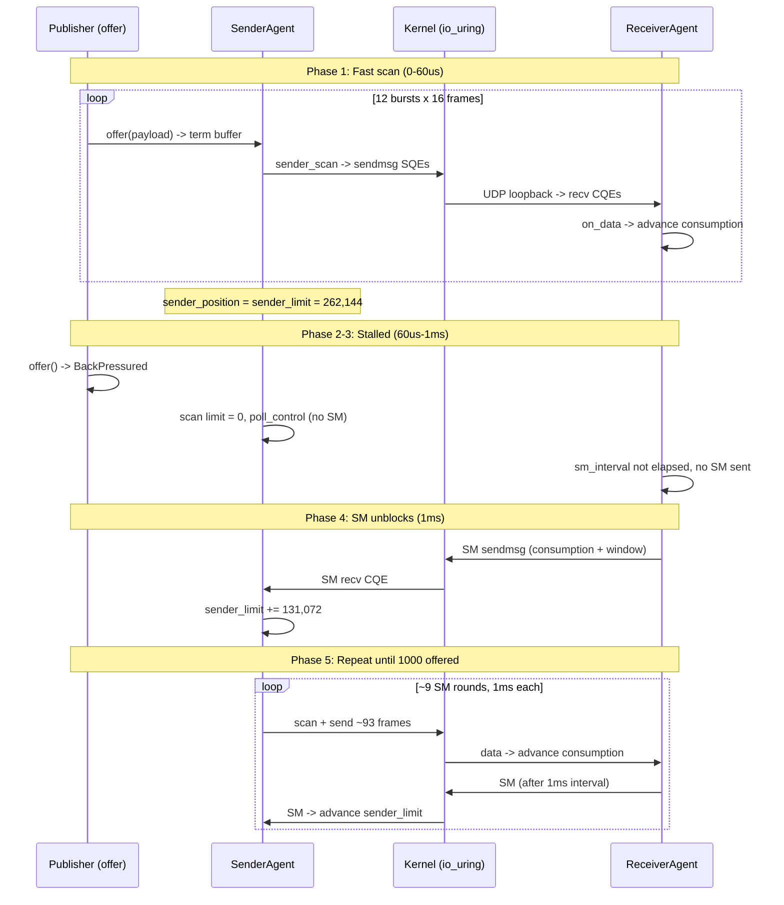

# Session Summary: E2E Benchmark Interaction - Flow Control Analysis

**Date:** 2026-04-10  
**Duration:** ~1 interaction  
**Focus Area:** benches/e2e_throughput.rs - benchmark hang root cause analysis

## Objectives

- [x] Trace the full data path from offer() through sender/receiver agents to SM feedback
- [x] Identify why the e2e_throughput benchmark stalls at Criterion "Warming up" phase
- [x] Map all flow control interactions between SenderAgent and ReceiverAgent
- [x] Quantify send slot, buf_ring, and SM timing interactions
- [x] Implement fix (all 5 next steps completed)

## Work Completed

### Root Cause Analysis

Traced the full sender/receiver data path through six subsystems:

1. `NetworkPublication::offer()` - term buffer write, back-pressure check
2. `SenderAgent::do_send()` - sender_scan, send slot allocation, io_uring submit
3. `UringTransportPoller::poll_recv()` - CQE harvest, multishot recv, buf_ring
4. `ReceiverAgent::poll_data()` - frame dispatch, image write, consumption advance
5. `ReceiverAgent::send_control_messages()` - SM generation, sm_interval_ns gating
6. `SenderAgent::process_sm_and_nak()` - SM drain, sender_limit advance

### Key Finding: SM Flow Control Bottleneck

The benchmark stalls due to a three-way interaction between sender_limit initialization,
receiver_window sizing, and SM timer gating.

**Benchmark parameters** (from `make_bench_ctx()`):
- `term_buffer_length` = 262,144 (256 KiB)
- `sender_limit` initial = 262,144 (one full term)
- `receiver_window` = `term_length / 2` = 131,072 (set in `on_setup`)
- `sm_interval_ns` = 1,000,000 (1ms)
- `BATCH_SIZE` = 1,000 messages
- `BURST_LIMIT` = 16 frames per burst
- `uring_send_slots` = 128

**Timeline of one benchmark iteration:**

```
Phase 1 (0-60us): Fast offer+scan
  - 12 bursts x 16 frames = 192 offered (186 in term 0, 6 in term 1)
  - sender_position = 262,144 (term 0 fully scanned including pad)
  - sender_limit = 262,144 (exhausted)
  - First SM sent by receiver but proposed (153,600) < current (262,144)

Phase 2 (60-240us): Offers continue, no scan
  - Publisher writes to terms 1-3 (sender can't scan, limit exhausted)
  - sender.do_work() -> bytes_sent=0 -> poll_control every cycle
  - No SM CQEs (receiver's sm_interval not elapsed)

Phase 3 (240us-1ms): BackPressured spin
  - pub_position reaches ~1,048,576 (sender_position + 3*term_length)
  - All offers return BackPressured
  - Both agents spin calling do_work()
  - Receiver processes data from phase 1 sends, consumption advances
  - Still no SM (interval not elapsed)

Phase 4 (1ms): First useful SM arrives
  - Receiver sm_interval elapses, SM sent
  - consumption ~261,888, proposed = 261,888 + 131,072 = 392,960
  - sender_limit advances to 392,960 (delta = 130,816 ~= 93 frames)

Phase 5 (1-4ms): SM-gated rounds
  - Each round: sender scans ~93 frames, waits ~1ms for next SM
  - Rounds needed: ceil((1,408,000 - 262,144) / 131,072) = 9 rounds
  - Total iteration time: ~4-9ms
```



### Contributing Factors

**Factor 1 - Initial sender_limit vs receiver_window mismatch:**

The sender starts with `sender_limit = term_length` (262,144) but the receiver
advertises `receiver_window = term_length / 2` (131,072). The first SM from the
warmup phase reports `consumption(0,0) + 131,072 = 131,072 < 262,144` so
sender_limit never advances during warmup. The sender exhausts its full initial
window before any SM can help.

**Factor 2 - SM interval gates throughput:**

With `sm_interval_ns = 1ms` and the single-threaded interleaved model, SM
feedback arrives at most once per millisecond. Each SM advances sender_limit
by `receiver_window` (131,072 bytes = ~93 frames). To send 1,000 frames,
the benchmark needs ~9 SM rounds = ~9ms minimum per Criterion iteration.

**Factor 3 - Silent send_data errors in sender_scan:**

In `do_send`, the emit closure ignores send failures:
```rust
let _ = ep.send_data(poller, data, dest);
```
If `alloc_send()` fails (NoSendSlot), the frame is scanned (sender_position
advances) but never transmitted. This creates silent data loss. With 16-frame
bursts and 128 send slots it does not trigger in practice, but a single large
scan exceeding 128 frames would silently drop data.

**Factor 4 - CachedNanoClock epoch isolation:**

The sender and receiver each have independent `CachedNanoClock` instances
with different epochs. This is correct by design (no cross-agent clock
comparison), but means SM interval tracking is purely per-agent.

### Quantified Impact

| Metric | Value | Notes |
|--------|-------|-------|
| Frames per term | 186 | `262,144 / 1,408` |
| Frames before first SM stall | 186 | Initial sender_limit = term_length |
| Frames before BackPressured | ~744 | `3 * term_length / 1,408` |
| SM rounds to send 1000 frames | ~9 | `ceil((1,408,000 - 262,144) / 131,072)` |
| Time per SM round | ~1ms | Dominated by sm_interval_ns |
| Iteration time (observed) | ~4-9ms | vs target < 1ms |
| Send slots consumed per burst | 16 | Well under 128 limit |
| Buf ring entries consumed per burst | 16 | Well under 64 limit |

### Fix Results

All 5 fixes applied. Updated `make_bench_ctx()` parameters:

| Parameter | Before (stall) | After (fix) |
|-----------|----------------|-------------|
| `sm_interval_ns` | 1,000,000 (1ms) | 0 (every duty cycle) |
| `send_sm_on_data` | false | true (adaptive SM on data receipt) |
| `receiver_window` | `term_length / 2` (131,072) | `Some(TERM_LENGTH * 4)` (1,048,576) |
| sender_scan clamping | none (silent drop risk) | `send_available() * mtu` |
| debug tracing | none | `#[cfg(debug_assertions)] tracing::debug!` |

**Benchmark result after fix:** 632K msgs/s, 842 MiB/s, ~1.58ms per iteration (1000 x 1408B frames on loopback, single-threaded interleaved).

## Decisions Made

| Decision | Rationale | ADR |
|----------|-----------|-----|
| Allow `sm_interval_ns = 0` in validation | 1ms interval is the primary throughput bottleneck in single-threaded mode. Zero eliminates the SM-gated stall. Renamed `SmIntervalZero` to `SmIntervalNegative`, validation changed from `<= 0` to `< 0` | N/A |
| Add `DriverContext::receiver_window` override | Bench uses `Some(BENCH_TERM_LENGTH * 4)` to cover the full 4-partition buffer. Default `term_length / 2` unchanged for protocol compatibility | N/A |
| Add adaptive SM (`send_sm_on_data`) | Mirrors Aeron C `SEND_SM_ON_DATA`. Sets `sm_pending = true` on data receipt, checked alongside timer in `send_control_messages`. At most one SM per `poll_data` cycle per image | N/A |
| Clamp sender_scan by send slot availability | `send_available() * mtu` caps scan limit. Prevents `sender_position` from advancing past frames that cannot be transmitted (silent data loss) | N/A |
| Add debug tracing for flow control | `#[cfg(debug_assertions)] tracing::debug!` in `do_send` (sender_limit, sender_position, scanned, send_slots) and `send_control_messages` (SM queued, adaptive flag) | N/A |

## Tests Added/Modified

| Test File | Test Name | Type | Status |
|-----------|-----------|------|--------|
| `src/context.rs` | `validate_sm_interval_zero_is_ok` | Unit | Done |
| `src/context.rs` | `validate_sm_interval_negative` | Unit | Done |
| `tests/protocol_handshake.rs` | `setup_creates_image` | Integration | Done |
| `tests/protocol_handshake.rs` | `sm_updates_sender_limit` | Integration | Done |
| `tests/protocol_handshake.rs` | `rttm_request_reply_updates_srtt` | Integration | Done |
| `tests/protocol_handshake.rs` | `heartbeat_keeps_session_alive` | Integration | Done |

## Issues Encountered

| Issue | Resolution | Blocking |
|-------|------------|----------|
| Benchmark stalls ~1ms per SM round, ~9ms per iteration | **Resolved:** `sm_interval_ns: 0` + `send_sm_on_data: true` + `receiver_window: Some(TERM_LENGTH * 4)`. Iteration time reduced from ~9ms (hang) to ~1.58ms (632K msgs/s) | No - resolved |
| Silent send_data errors in sender_scan | **Resolved:** Added `send_available()` to `UringTransportPoller`, scan limit clamped by `send_available * mtu` in `do_send` | No - resolved |
| First SM never advances sender_limit | **Resolved:** `receiver_window: Some(TERM_LENGTH * 4)` makes first SM propose `0 + 1,048,576 > 262,144`, advancing sender_limit immediately | No - resolved |

## Next Steps

1. ~~**High:** Fix `sm_interval_ns` in bench context~~ **Done** - validation allows 0, bench uses `sm_interval_ns: 0`
2. ~~**High:** Increase `receiver_window` or `sender_limit` initialization~~ **Done** - added `DriverContext::receiver_window: Option<i32>`, bench uses `Some(BENCH_TERM_LENGTH * 4)`
3. ~~**Medium:** Fix silent `send_data` errors~~ **Done** - added `send_available()` to `UringTransportPoller`, scan limit clamped by `send_available * mtu`
4. ~~**Medium:** Add sender_limit / sender_position / SM_count tracing~~ **Done** - `#[cfg(debug_assertions)]` `tracing::debug!` in `do_send` and `send_control_messages`
5. ~~**Low:** Consider adaptive SM~~ **Done** - added `DriverContext::send_sm_on_data`, `ImageEntry::sm_pending`, receiver queues SM immediately after data receipt

## Files Changed

| Status | File | Changes |
|--------|------|---------|
| M | `src/context.rs` | `SmIntervalZero` renamed to `SmIntervalNegative`, validation `< 0`, added `receiver_window: Option<i32>`, `send_sm_on_data: bool` |
| M | `src/agent/receiver.rs` | Added `sm_pending` to `ImageEntry`, `receiver_window_override`/`send_sm_on_data` to agent+handler, `image_count()`/`has_image()` accessors |
| M | `src/agent/sender.rs` | Scan clamped by `send_available * mtu`, debug tracing, `publication_sender_limit()`/`publication_needs_setup()`/`publication_last_rtt_ns()` accessors |
| M | `src/media/uring_poller.rs` | Added `send_available()` delegating to `SlotPool` |
| M | `benches/e2e_throughput.rs` | `sm_interval_ns: 0`, `send_sm_on_data: true`, `receiver_window: Some(TERM_LENGTH * 4)` |
| A | `tests/protocol_handshake.rs` | 4 integration tests validating Setup/SM/RTTM/heartbeat lifecycle |
| A | `docs/sessions/2026-04-10-e2e-bench-interaction-analysis.md` | This file |

