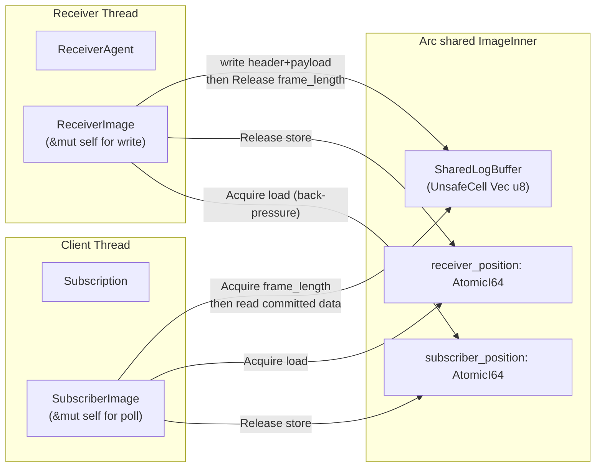
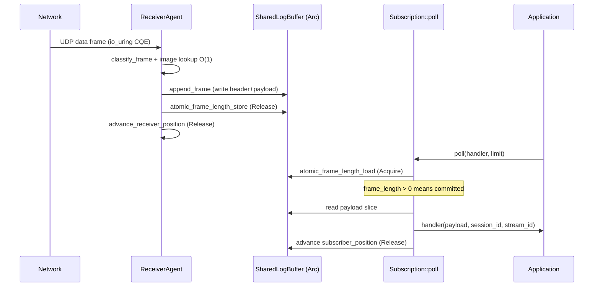

# Session Summary: Subscription::poll() Data Path Implementation Plan

**Date:** 2026-04-10  
**Duration:** ~1 interaction  
**Focus Area:** client/subscription.rs, media/shared_image.rs (new), agent/receiver.rs, client/bridge.rs

## Objectives

- [x] Analyze existing cross-thread patterns (ConcurrentPublication, PublicationBridge)
- [x] Analyze receiver agent image management (ImageEntry, RawLog, InlineHandler)
- [x] Design shared image buffer (receiver writes, client reads via Acquire/Release)
- [x] Design SubscriptionBridge (lock-free image handle transfer: receiver -> client)
- [x] Design Subscription::poll() fragment scan algorithm
- [x] Plan back-pressure from client to receiver
- [x] Identify all files to create and modify
- [x] Implement shared_image.rs (ReceiverImage, SubscriberImage, ImageInner, poll_fragments)
- [x] Implement SubscriptionBridge (sub_bridge.rs - deposit/try_take with Acquire/Release)
- [x] Modify ReceiverAgent to use ReceiverImage (image_handles, on_setup deposits to bridge)
- [x] Implement Subscription::poll() (drain_bridge, remove_closed, round-robin poll)
- [x] Wire up in MediaDriver and Aeron (sub_bridge Arc shared through connect)

## Analysis

### Problem Statement

`Subscription::poll()` currently returns 0 (stub). The receiver agent writes data frames into
private `RawLog` buffers (`image_logs: Vec<Option<RawLog>>`). No mechanism exists to share these
buffers with the client thread. The client has no way to read received data.

### Existing Pattern: ConcurrentPublication (reversed)

The `ConcurrentPublication` / `SenderPublication` pair already solves the cross-thread shared
buffer problem for the **send** path:

```
App thread (writer) ---Release frame_length---> Sender thread (reader)
                    <--Acquire sender_position--
```

For subscriptions, we need the **reverse**:

```
Receiver thread (writer) ---Release frame_length---> Client thread (reader)
                         <--Acquire sub_position----
```

The same `SharedLogBuffer` + `AtomicI64` position + `atomic_frame_length_store/load` primitives
apply with roles swapped.

### Key Components in the Existing Send Path

| Component | Role | File |
|-----------|------|------|
| `SharedLogBuffer` | `UnsafeCell<Vec<u8>>`, 4-partition term buffer, allocated once | `media/term_buffer.rs` |
| `PublicationInner` | `Arc`-shared state: log + positions + immutable config | `media/concurrent_publication.rs` |
| `ConcurrentPublication` | Writer handle (app thread), `offer()` with Release commit | `media/concurrent_publication.rs` |
| `SenderPublication` | Reader handle (sender thread), `sender_scan()` with Acquire reads | `media/concurrent_publication.rs` |
| `PublicationBridge` | Lock-free SPSC: transfers `PendingPublication` from client to sender | `client/bridge.rs` |

### Receiver Agent Image Internals

```rust
// agent/receiver.rs
struct ImageEntry {          // [ImageEntry; 256] flat array, pre-sized
    session_id: i32,
    stream_id: i32,
    initial_term_id: i32,
    active_term_id: i32,
    term_length: u32,
    consumption_term_id: i32,
    consumption_term_offset: i32,
    // ... timing, source_addr, etc.
}

// Parallel array - one RawLog per image
image_logs: Vec<Option<RawLog>>,  // pre-sized to MAX_IMAGES, never resized
```

In `InlineHandler::on_data`, frames are written via `raw_log.append_frame(pidx, term_offset, data_header, payload)`.
In `InlineHandler::on_setup`, a new `RawLog::new(term_length)` is allocated (cold path).

### What Needs to Change

Replace private `RawLog` with shared `ImageInner` (analogous to `PublicationInner`). The receiver
writes via `ReceiverImage` handle; the client reads via `SubscriberImage` handle. Both wrap
`Arc<ImageInner>`.

## Design

### Architecture Overview



### Step 1: `src/media/shared_image.rs` (New File)

**Goal:** Shared image state + two handles (ReceiverImage, SubscriberImage).

#### ImageInner (Arc-shared)

```rust
pub(crate) struct ImageInner {
    log: SharedLogBuffer,
    /// Written by receiver (Release), read by subscriber (Acquire).
    receiver_position: AtomicI64,
    /// Written by subscriber (Release), read by receiver for back-pressure (Acquire).
    subscriber_position: AtomicI64,
    /// Set by receiver when image is removed/closed. Subscriber checks during poll.
    closed: AtomicBool,  // Ordering::Release / Acquire

    // Immutable after construction:
    session_id: i32,
    stream_id: i32,
    initial_term_id: i32,
    term_length: u32,
    term_length_mask: u32,          // term_length - 1
    position_bits_to_shift: u32,    // term_length.trailing_zeros()
}
```

#### ReceiverImage (writer handle, owned by ReceiverAgent)

```rust
pub struct ReceiverImage {
    inner: Arc<ImageInner>,
    /// Local cached position. Single writer - no atomic load needed per write.
    receiver_position_local: i64,
}
```

Methods:
- `append_frame(partition_idx, term_offset, data_header, payload) -> Result<u32, AppendError>`
  - Same as `RawLog::append_frame` but writes into `SharedLogBuffer` via `unsafe as_mut_ptr()`
  - Commits with `atomic_frame_length_store(ptr, offset, frame_length)` (Release)
- `advance_receiver_position(new_pos: i64)`
  - `self.receiver_position_local = new_pos`
  - `inner.receiver_position.store(new_pos, Ordering::Release)`
- `clean_partition(partition_idx)`
  - Delegates to `inner.log.clean_partition(partition_idx)`
- `check_back_pressure() -> bool`
  - `let sub_pos = inner.subscriber_position.load(Ordering::Acquire);`
  - `self.receiver_position_local - sub_pos >= (PARTITION_COUNT - 1) as i64 * term_length as i64`
  - Returns `true` if subscriber is too far behind (drop frames for this image)
- `close()`
  - `inner.closed.store(true, Ordering::Release)`

#### SubscriberImage (reader handle, owned by Subscription)

```rust
pub struct SubscriberImage {
    inner: Arc<ImageInner>,
    /// Local cached position. Single reader - avoids atomic load per poll.
    subscriber_position_local: i64,
}
```

Methods:
- `poll_fragments<F>(handler: F, limit: i32) -> i32 where F: FnMut(&[u8], i32, i32)`
  - Algorithm mirrors `SenderPublication::sender_scan()` exactly:
    1. Compute `term_id` and `term_offset` from `subscriber_position_local`
    2. Compute `partition_idx` via `partition_index(term_id, initial_term_id)` (bitmask)
    3. Walk frames: `atomic_frame_length_load` (Acquire) at each offset
    4. If `frame_length > 0` and >= `DATA_HEADER_LENGTH`: frame is committed
    5. Extract payload slice: `&data[DATA_HEADER_LENGTH..frame_length]`
    6. Call `handler(payload, session_id, stream_id)`
    7. Advance by `align_frame_length(frame_length)`
    8. After scan: `subscriber_position_local += scanned`
    9. `inner.subscriber_position.store(subscriber_position_local, Ordering::Release)`
  - Returns fragment count (not byte count - different from sender_scan)
  - Handles term boundary: if at end of term, advance to next term_id
- `is_closed() -> bool`
  - `inner.closed.load(Ordering::Acquire)`
- `session_id() -> i32`, `stream_id() -> i32`, `position() -> i64` - accessor methods

#### Constructor

```rust
pub fn new_shared_image(
    session_id: i32,
    stream_id: i32,
    initial_term_id: i32,
    active_term_id: i32,
    term_length: u32,
    initial_term_offset: i32,
) -> Option<(ReceiverImage, SubscriberImage)>
```

- Validates `term_length` (power-of-two, >= 32)
- Creates `SharedLogBuffer::new(term_length)`
- Computes initial position from `active_term_id` + `initial_term_offset`
- Returns `None` if invalid params

### Step 2: `src/client/sub_bridge.rs` (New File)

**Goal:** Lock-free SPSC transfer of `SubscriberImage` handles from receiver to client.

Same pattern as `PublicationBridge` but in reverse direction (receiver deposits, client takes).

```rust
const SUB_BRIDGE_CAPACITY: usize = 32;

pub(crate) struct PendingImage {
    pub image: SubscriberImage,
    pub session_id: i32,
    pub stream_id: i32,
    pub correlation_id: i64,
}

pub(crate) struct SubscriptionBridge {
    slots: Box<[BridgeSlot<PendingImage>]>,
}
```

State machine per slot: `EMPTY -> FILLED (receiver) -> EMPTY (client)`.
Same `AtomicU8` + `UnsafeCell` pattern. Same `Acquire/Release` ordering.

Separate from `PublicationBridge` because:
- Different `PendingXxx` type (no endpoint/addr needed)
- Different producer/consumer (receiver produces, client consumes)
- Clean single-responsibility per file

### Step 3: Modify `ReceiverAgent` (`agent/receiver.rs`)

**Changes:**

| Current | New |
|---------|-----|
| `image_logs: Vec<Option<RawLog>>` | `image_handles: Vec<Option<ReceiverImage>>` |
| `RawLog::new(term_length)` in `on_setup` | `new_shared_image(...)` in `on_setup` |
| `raw_log.append_frame(...)` in `on_data` | `recv_image.append_frame(...)` in `on_data` |
| `raw_log.clean_partition(pidx)` in `on_data` | `recv_image.clean_partition(pidx)` in `on_data` |
| No bridge field | `sub_bridge: Arc<SubscriptionBridge>` |

In `on_setup`, after creating the shared image pair:
1. Store `ReceiverImage` in `image_handles[idx]`
2. Deposit `SubscriberImage` into `sub_bridge` as `PendingImage`
3. If deposit fails (bridge full), log warning, drop `SubscriberImage` (image still works
   for receiver-side protocol but client cannot read it)

Add `ReceiverAgent::set_subscription_bridge(bridge: Arc<SubscriptionBridge>)` method
(mirrors `SenderAgent::set_publication_bridge`).

**Optional back-pressure in `on_data`:** Before writing, call `recv_image.check_back_pressure()`.
If subscriber is too far behind, skip the write (frame is effectively "dropped" from the
subscriber's perspective, but the receiver still processes protocol - SM, NAK tracking, etc.).
This prevents unbounded growth in unread data.

### Step 4: Modify `Subscription` (`client/subscription.rs`)

**Changes:**

```rust
pub struct Subscription {
    // ...existing fields...
    sub_bridge: Arc<SubscriptionBridge>,
    images: [Option<SubscriberImage>; MAX_SUB_IMAGES],  // pre-sized, e.g. 16
    image_count: usize,
}
```

**`poll()` implementation:**

```rust
pub fn poll<F>(&mut self, mut handler: F, limit: i32) -> i32
where
    F: FnMut(&[u8], i32, i32),
{
    // 1. Drain bridge for new images matching our stream_id.
    for idx in 0..SUB_BRIDGE_CAPACITY {
        if self.image_count >= MAX_SUB_IMAGES { break; }
        if let Some(pending) = self.sub_bridge.try_take(idx) {
            if pending.stream_id == self.stream_id {
                self.images[self.image_count] = Some(pending.image);
                self.image_count += 1;
            }
            // If stream_id doesn't match, image is for a different subscription.
            // For v1 (single subscription per bridge), this should not happen.
            // For multi-sub, need per-stream filtering or separate bridges.
        }
    }

    // 2. Remove closed images.
    let mut i = 0;
    while i < self.image_count {
        if self.images[i].as_ref().map_or(false, |img| img.is_closed()) {
            // Swap-remove with last.
            self.images[i] = self.images[self.image_count - 1].take();
            self.image_count -= 1;
        } else {
            i += 1;
        }
    }

    // 3. Poll each image, round-robin fair.
    let mut total_fragments = 0i32;
    let remaining = limit;
    for i in 0..self.image_count {
        if remaining <= 0 { break; }
        if let Some(ref mut img) = self.images[i] {
            let per_image_limit = remaining / (self.image_count - i) as i32;
            let fragments = img.poll_fragments(&mut handler, per_image_limit.max(1));
            total_fragments += fragments;
        }
    }

    total_fragments
}
```

### Step 5: Wire Up in MediaDriver and Aeron

#### `client/media_driver.rs`

```rust
pub struct MediaDriver {
    // ...existing fields...
    sub_bridge: Arc<SubscriptionBridge>,  // NEW
}
```

In `launch()`:
1. Create `SubscriptionBridge::new()`
2. Pass `Arc::clone(&sub_bridge)` to `ReceiverAgent` via `set_subscription_bridge()`
3. Store in `MediaDriver` for `connect()`

In `connect()`:
1. Pass `Arc::clone(&self.sub_bridge)` to `Aeron::connect_in_process()`

#### `client/aeron.rs`

```rust
pub struct Aeron {
    // ...existing fields...
    sub_bridge: Arc<SubscriptionBridge>,  // NEW
}
```

In `add_subscription()`:
1. Pass `Arc::clone(&self.sub_bridge)` to `Subscription::new()`

### Atomic Ordering Summary

| Field | Writer | Reader | Ordering | Purpose |
|-------|--------|--------|----------|---------|
| `frame_length` (in buffer) | Receiver | Subscriber | Release / Acquire | Commit barrier for frame data |
| `receiver_position` | Receiver | Subscriber | Release / Acquire | Subscriber knows how far receiver has written |
| `subscriber_position` | Subscriber | Receiver | Release / Acquire | Back-pressure: receiver checks if subscriber caught up |
| `closed` | Receiver | Subscriber | Release / Acquire | Image lifecycle signal |
| Bridge slot `state` | Receiver (deposit) | Subscriber (take) | Release / Acquire | Handle transfer |

No SeqCst. No Mutex. No RwLock. Same ordering pattern as ConcurrentPublication.

### Data Flow (Complete Path)



## Decisions Made

| Decision | Rationale | ADR |
|----------|-----------|-----|
| Reuse SharedLogBuffer (not RawLog) for shared images | SharedLogBuffer already has UnsafeCell + Send + Sync + atomic helpers. RawLog is single-thread only (no UnsafeCell). Avoids duplicating buffer infrastructure | N/A |
| Separate SubscriptionBridge file (not merged with PublicationBridge) | Different PendingXxx type, different direction (receiver->client vs client->sender). Single-responsibility per file. No generic needed - both bridges are simple and small | N/A |
| Pre-sized `[Option<SubscriberImage>; 16]` in Subscription | No allocation in poll() hot path. 16 images per subscription is generous (typical: 1-4 publishers per stream). Array fits in ~2 cache lines of pointers | N/A |
| Back-pressure via subscriber_position check in receiver | Prevents receiver from overwriting unread frames. Same 3-term-ahead limit as ConcurrentPublication. One Acquire load per image per duty cycle - acceptable overhead | N/A |
| Close signal via AtomicBool (not Option/drop) | Arc prevents drop-based signaling (both sides hold Arc). AtomicBool is 1 byte, zero cost when not checked. Subscriber removes image on next poll() | N/A |
| poll() returns fragment count (not byte count) | Matches Aeron Java/C API: `subscription.poll(handler, fragmentLimit)` returns int fragment count. User controls throughput via limit parameter | N/A |

## Tests Added/Modified

| Test File | Test Name | Type | Status |
|-----------|-----------|------|--------|
| `src/media/shared_image.rs` | `new_shared_image_valid_params` | Unit | Done |
| `src/media/shared_image.rs` | `new_shared_image_rejects_invalid` | Unit | Done |
| `src/media/shared_image.rs` | `append_and_poll_single_frame` | Unit | Done |
| `src/media/shared_image.rs` | `poll_returns_zero_when_empty` | Unit | Done |
| `src/media/shared_image.rs` | `poll_advances_subscriber_position` | Unit | Done |
| `src/media/shared_image.rs` | `multiple_frames_polled_in_order` | Unit | Done (extra) |
| `src/media/shared_image.rs` | `poll_respects_limit` | Unit | Done (extra) |
| `src/media/shared_image.rs` | `back_pressure_detected` | Unit | Done |
| `src/media/shared_image.rs` | `close_signal_visible` | Unit | Done |
| `src/media/shared_image.rs` | `cross_thread_write_poll` | Unit | Done |
| `src/media/shared_image.rs` | `term_rotation_and_poll` | Unit | Planned |
| `src/client/sub_bridge.rs` | `new_bridge_has_all_empty_slots` | Unit | Done |
| `src/client/sub_bridge.rs` | `bridge_capacity_matches_constant` | Unit | Done |
| `src/client/sub_bridge.rs` | `try_take_out_of_bounds_returns_none` | Unit | Done |
| `src/client/sub_bridge.rs` | `deposit_and_take` | Unit | Planned |
| `tests/client_library.rs` | `subscription_poll_receives_data` | Integration | Planned |
| `tests/client_library.rs` | `subscription_poll_multiple_fragments` | Integration | Planned |
| `tests/e2e_send_recv.rs` | `publication_to_subscription_e2e` | Integration | Planned |

## Issues Encountered

| Issue | Resolution | Blocking |
|-------|------------|----------|
| ReceiverAgent currently writes via `RawLog::append_frame` which takes `&mut self` on `RawLog` | Resolved: `ReceiverImage::append_frame` uses `SharedLogBuffer::as_mut_ptr()` (unsafe) with same safety contract as ConcurrentPublication | No |
| InlineHandler borrows `image_logs: &mut [Option<RawLog>]` - needs to become `&mut [Option<ReceiverImage>]` | Resolved: type changed to `image_handles: &mut [Option<ReceiverImage>]`. All call sites updated | No |
| Bridge needs to filter by stream_id when multiple subscriptions exist | Resolved: `Subscription::drain_bridge()` filters by `stream_id` in `poll()`. For v1 with single bridge this is sufficient | No |
| `ReceiverImage::append_frame` must replicate RawLog::append_frame logic | Resolved: implemented in `shared_image.rs` using `SharedLogBuffer::as_mut_ptr()` + `atomic_frame_length_store` for commit | No |
| SharedLogBuffer term rotation: receiver must clean partitions before subscriber reads stale data | Resolved: back-pressure guarantees subscriber finished reading before receiver cleans. Documented in safety comments | No |
| `cross_thread_write_poll` test hung due to writing 20 frames into 1024-byte term (only 16 fit) | Resolved: increased test term_length to 2048 so all 20 frames fit in one partition | No |
| Stale `NOTE: Data path (Subscription::poll) is not yet implemented` comment in `client/aeron.rs` line 193 | Open: comment should be removed or updated now that poll() is implemented | No |

## Next Steps

1. ~~**High:** Implement `src/media/shared_image.rs` - core data structure (Step 1)~~ Done
2. ~~**High:** Implement `src/client/sub_bridge.rs` - handle transfer mechanism (Step 2)~~ Done
3. ~~**High:** Modify `agent/receiver.rs` - switch from RawLog to ReceiverImage (Step 3)~~ Done
4. ~~**High:** Implement `Subscription::poll()` with fragment scan (Step 4)~~ Done
5. ~~**Medium:** Wire up in MediaDriver + Aeron (Step 5)~~ Done
6. **Medium:** Add remaining unit tests (`term_rotation_and_poll`, `deposit_and_take`)
7. **Medium:** Add integration tests in tests/client_library.rs (`subscription_poll_receives_data`, `subscription_poll_multiple_fragments`)
8. **Medium:** Add end-to-end test (`publication_to_subscription_e2e` in tests/e2e_send_recv.rs)
9. **Low:** Remove stale `NOTE: Data path (Subscription::poll) is not yet implemented` comment in `client/aeron.rs`
10. **Low:** Update ARCHITECTURE.md Section 20 - mark Subscription data path as implemented

## Files Changed

| Status | File | Impl |
|--------|------|------|
| A | `src/media/shared_image.rs` | Done |
| A | `src/client/sub_bridge.rs` | Done |
| M | `src/media/mod.rs` | Done |
| M | `src/client/mod.rs` | Done |
| M | `src/agent/receiver.rs` | Done |
| M | `src/client/subscription.rs` | Done |
| M | `src/client/aeron.rs` | Done |
| M | `src/client/media_driver.rs` | Done |
| M | `tests/client_library.rs` | Planned (integration tests) |

